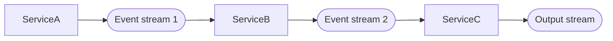

# Building Workflows with Microservices

- Comment créer et modifier des workflows avec des microservices :
  - Comment les microservices sont liés les uns aux autres
  - Comment modifier les microservices sans :
    - Casser les processus en cours d'exécution
    - Avoir devoir modifier tous les microservices
    - Casser le monitoring

- Comment monitorer les workflow :
  - Quand un workflow est-il terminé ?
  - Comment savoir si un évènement à fait échoué le processus et est resté bloqué à une étape du workflow ?
  - Comment monitorer le statut d'exécution d'un workflow de manière globale ?

- Comment implémenter une transaction distribuée :
  - Combien de microservices sont impliqués dans une transaction ?
  - Comment faire un rollback d'une transaction distribué ?

## The Choreography Pattern

Le pattern choreography est un modèle de communication entre microservices où chaque microservice est responsable de déclencher des actions en fonction des événements qu'il reçoit. Il n'y a pas de contrôleur central qui orchestre les actions des microservices. Chacun opère leurs traitement de manière autonome sans prendre en compte les autres microservices. Lorsqu'un producteur envoie un événement, il ne sait pas qui va le consommer. Ce pattern est adapté pour des workflows inter domaines où les microservices sont indépendants les uns des autres et fortement découplés, ce qui permet de réduire la coordination entre les équipes. De nouveaux microservices peuvent être ajoutés sans impacter les autres microservices, pendant que d'autres peuvent être décommissionnés. Le workflow n'est pas défini par un workflow mais bien par l'enchaînement des événements qui sont envoyés et traités par les microservices.

Il est important de noter que le pattern choregraphy est associé à l'event driven architecture, car les producteurs et les consommateurs peuvent être implémentés avec de manière indépendante et découplée. Ce qui contraste avec les architectures microservices point à point où le focus est mis sur la réutilisation des services de manière à composer des workflows et étendre les fonctionnalités métiers. Par définition, ceci implique que chaque microservice doit connaître sont destinataire et ce qu'il doit faire.

### A Simple Event-Driven Choreography Example

Dans le cas où l'ordre doit changer, par exemple ServiceB doit être exécuté après ServiceC, les deux services doivent être modifiés pour envoyer et recevoir les événements correctement. De même que les événements d'output doivent éventuellement être modifiés pour être envoyés.

### Creating and Modifying a Choreography Workflow

Si le pattern choreography permet de facilement ajouter une nouvelle étape en fin de workflow, l'insertion d'une étape au milieu ou changer l'ordre peut être problématique. En outre, la compréhension de microservices peut être difficile hors du contexte du workflow, a fortiori si le workflow est complexe.

### Monitoring a Choreography Workflow

Monitorer les microservices dans un workflow choreography peut être difficile car il faut auditer tous les events d'un workflow. Ceci pourrait se faire dans _state store_ qui combine les événements ensembles. Ce n'est pas nécessairement une tâche facile, a fortiori si le workflow est complexe et est composé de nombreuses étapes, ce qui vient grossir la taille des données. De plus, pour chaque changement, il faut prévoir les effets de bord au niveau du monitoring.

Le monitoring se retrouve liè à ce que l'on veut voir du processus et peut être associé à la logique métier.

## The Orchestration Pattern

Le pattern orchestration est un modèle de communication entre microservices où un microservice central, appelé orchestrateur, est responsable de déclencher les actions des microservices. Le microservice orchestrateur contient toute la logique est envoi des évènements aux microservices pour qu'ils effectuent leurs traitements.

Le pattern permet une définition plus flexible en cas de changement du processus métier, de même qu'il concentre l'ordre des étapes et permet d'avoir une vue globale du workflow et de son statut d'avancement. L'orchestrateur va envoyé les commandes aux microservices "subordonnés" pour qu'ils effectuent leurs traitements et récupère les résultats pour les traiter, selon un principe de _request-response_ au travers des _event streams_.

Attention que la responsabilité de l'orchestrateur se limite à l'orchestration des microservices et ne vas pas au-delà. Si un microservice "subordonné" est de type choreography, l'orchestrateur n'est pas en mesure de gérer le déroulement du processus sous-jacent.

### A Simple Orchestration Example

### A Simple Direct-Call Orchestration Example