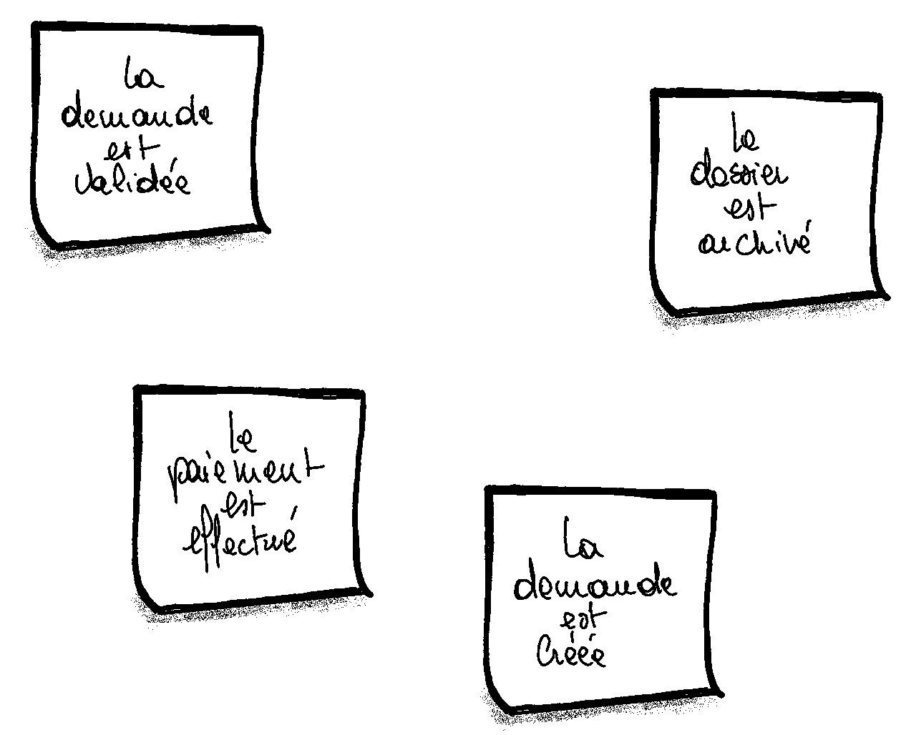
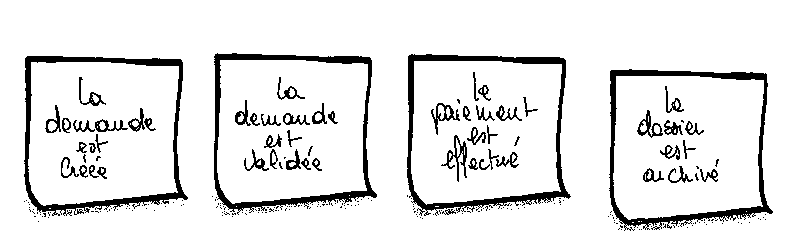
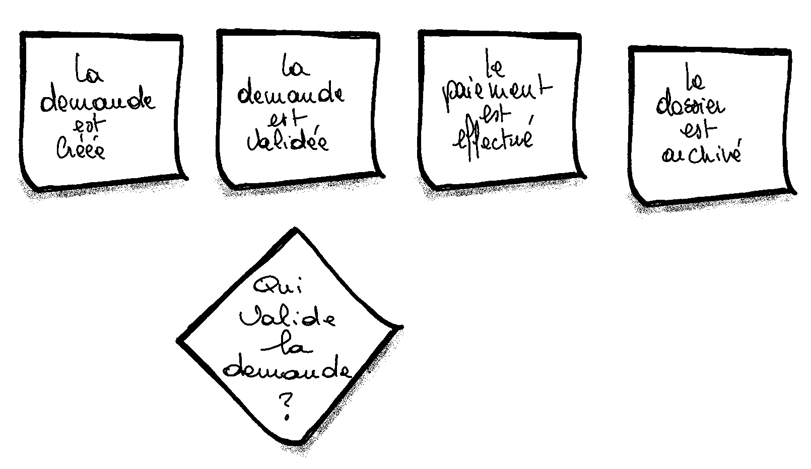
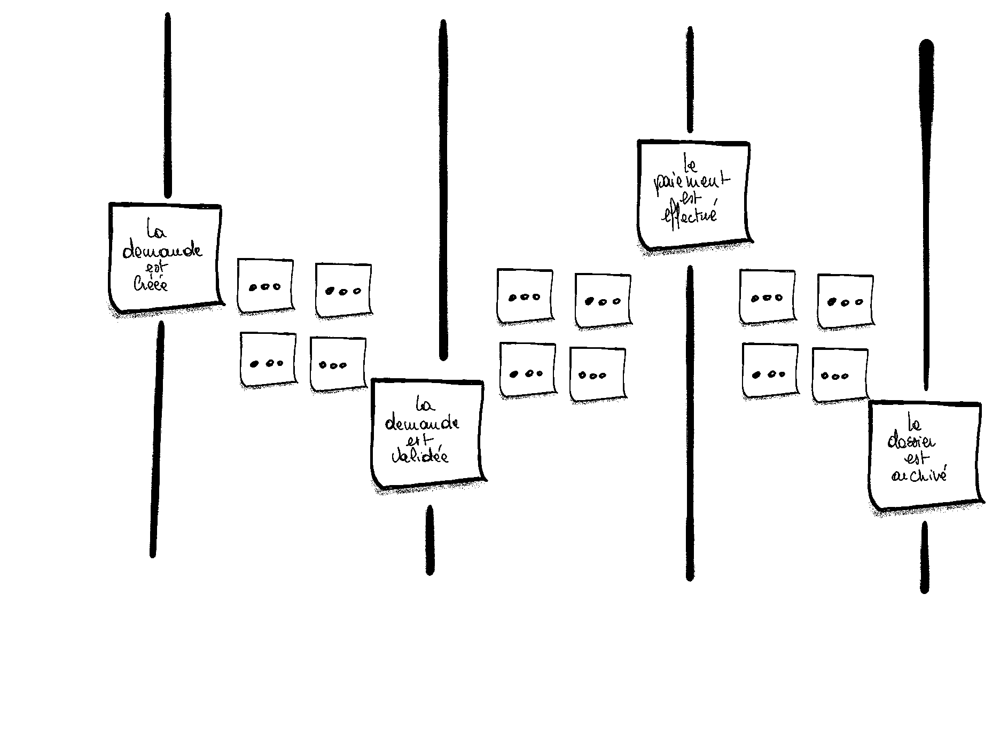

# EventStorming

## What is EventStorming

L'objectif de l'EventStorming est de modéliser un ensemble de processus métier en utilisant des événements. Les participants vont représenter la succession d'évènements sur des post-its collés sur un mur. Petit à petit le processus métier va se dessiner et se compléter avec des concepts tels que les acteurs, les commandes (cqrs), les systèmes externes, etc. pour enfin aboutir à une vue d'ensemble du processus métier.

## Who Should Participate in EventStorming

Aussi peut de personne qu'il est nécessaire.

## What Do You Need for EventStorming

- Un grand mur pour modéliser un processus métier.
- Des post-its de différentes couleurs (au moins 5 couleurs différentes) pour tous les participants
- Des marqueurs pour tous les participants pour écrire sur les post-its.
- Des snacks et des boissons pour garder de l'énergie.
- Une salle de réunion sans chaises pour garder les participants debout et actifs.

## The EventStorming Process

Il existe 10 étapes pour réaliser un EventStorming au cours desquelles le processus va s'enrichir et se compléter.

### Step 1: Unstructured Exploration

L'EventStorming commence par un brainstorming des évènements (_domain event_) liés au métier (_business domain_) que l'on explore. Un évènement est un fait qui a eu lieu dans le passé et qui a un impact sur le processus métier. Il est important que ce soit dans le passé.

Tous les participants utilisent des post-its __orange__ pour écrire tous les évènements qui leurs viennent en tête et le colle sur le mur dans n'importe quel ordre jusqu'à ce que plus personne n'ait (presque plus) d'idée.

### Step 2: Timelines

Ensuite, les participants vont regrouper les évènements en séquences logiques et chronologiques en fonction du processus métier. D'abord, le _happy flow_ (le scénario idéal) puis les scénarios alternatifs.

### Step 3: Pain Points

Une fois que les évènements sont organisés en séquences logiques, les participants vont identifier les points critiques (_pain points_) du processus métier pour lesquels des questions se posent (processus manuel, intégration, etc.). Les participants utilisent des post-its __rose__ pour écrire les questions et les colle en losange sur le mur.

Cette étape n'est pas la seul opportunité de mettre en évidence des points potentiellement problématiques et peut se faire tout au long du processus.

### Step 4: Pivotal Events

Une fois les phases précédentes terminées, les participants vont identifier les évènements qui sont cruciaux pour le processus métier, c'est-à-dire qui ont un impacte sur le contexte ou la phase du processus. Ces évènements sont appelés _pivotal events_ et sont représentés par une barre verticale pour séparer les évènements cruciaux des autres.

### Step 5: Commands

Tandis que les évènements représentent des faits passés, les commandes (_commands_) représentent ce qui déclenche un évènement ou un flux d'évènements. Les participants vont ajouter les post-its __bleu__ avec les commandes écrites sous forme impérative (ex: "Créer un compte", "Envoyer un email", etc.), juste avant les évènements qu'ils produisent.

Certaines des commandes peuvent être associée à des acteurs externes (systèmes externes, utilisateurs, etc.) et sont représentées par des post-its __jaune__, collé à côté de la commande.

### Step 6: Policies

Presque qu'à chaque fois, les commandes sont ajoutées, mais n'ont pas d'acteurs associés. Durant cette étape l'objectif est de trouver les raisons (_automation policy_) qui vont déclencher les commandes. Les participants vont ajouter des post-its __mauve__ avec les raisons, par exemple écrites sous forme de "Si... Alors..." (ex: "Si le solde est inférieur à 0, alors envoyer un email").

### Step 7: Read Models

Les _read models_ sont les données concernées par le processus que les acteurs utilisent pour prendre la décision d'exécuter des commandes. Les _read models_ sont représentés par des post-its __vert__ collés avant les commandes qui les concernent.

### Step 8: External Systems

Cette étape consiste à identifier les systèmes externes qui interagissent avec le processus métier. Les systèmes externes sont définis comme tout système qui n'est pas sous le contrôle du domaine métier (_business domain_). Les systèmes externes peuvent être en _input_ d'une commande en tant que déclencheur, ou en _output_ d'un évènement s'il doit être notifié de l'évènement.

Les systèmes externes sont représentés par des post-its __rose__ collés à côté des commandes qui les concernent.

À la fin de cette étapes, toutes les commandes doivent avoir soit un acteur, soit une raison (policy), soit un système externe associé.

### Step 9: Aggregates

Une fois tous les évènements et commandes représentés, les participants peuvent commencer à penser à comment les regrouper en _aggregates_. Un _aggregate_ va recevoir un ensemble de commandes et va produire des évènements.

### Step 10: Bounded Contexts

Enfin, la dernière étape consiste à identifier les liens et associations entre les différents _aggregates_. Soit les _aggregates_ ont un lien fort car ils sont les composant d'une même fonctionnalité, soit ils sont couplés par des dépendances.

### Variants

Les steps décrites ci-dessus ne sont pas gravées dans la pierre et peuvent être adaptées en fonction des besoins. La première étape est d'avoir une vue globale du domaine, de parler le même langage et de mettre en lumière les bounded contexts et leurs interactions.

Après avoir une idée de la vue globale et identifier les différents processus métier, une variante est de faire un EventStorming plus détaillé pour chaque processus métier nécessaire afin de modéliser le processus complet en détail.

À la fin de toutes les sessions d'EventStorming, le modèle complet des évènements, commandes, acteurs, systèmes externes et même les interactions entre les différents bounded contexts peuvent être mis à disposition pour les développeurs pour implémenter le processus métier. La valeur ajouté est d'avoir plusieurs parties prenantes qui parlent le même langage et qui partage la même une vue d'ensemble du processus métier.

## When to Use EventStorming

- __Construire un language commun et clair__ : L'EventStorming est un outil puissant pour construire un langage commun et clair entre les différentes parties prenantes d'un projet.
- __Avoir une représentation des processus__ : L'EventStorming permet de modéliser les processus métier de manière visuelle et de les partager avec les différentes parties prenantes.
- __Mettre en évidence de nouveaux besoins métier__ : L'EventStorming permet de mettre en lumière des besoins métier qui n'ont pas été pris en compte.
- __Recouvrir des processus métier oubliés__ : L'EventStorming permet de recouvrir des processus métier oubliés ou non documentés.
- __Améliorer des processus métier existants__ : L'EventStorming permet d'améliorer des processus métier existants en identifiant les points critiques et en proposant des solutions.
- __Faire un transfert de connaissance__ : L'EventStorming permet de faire un transfert de connaissance entre les différentes parties prenantes.