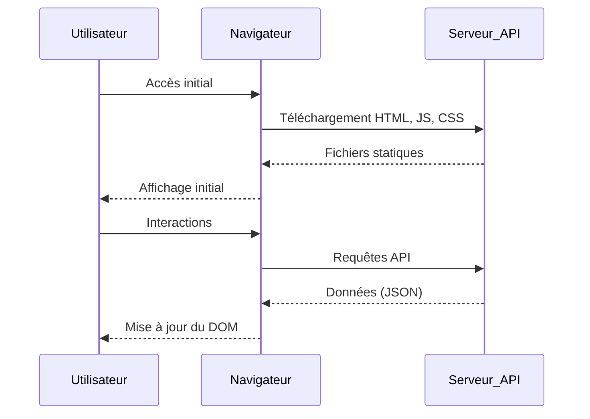
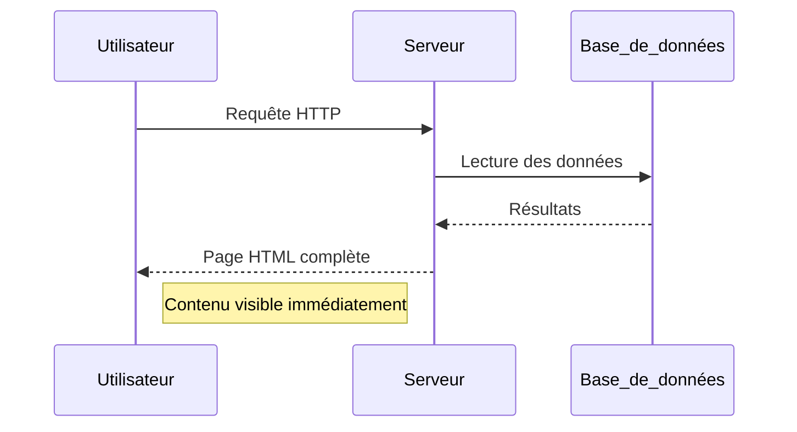
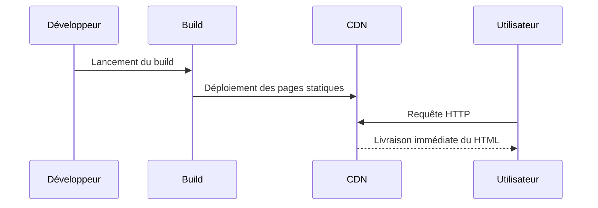

# Comment choisir votre architecture frontend

<iframe 
    data-testid="embed-iframe" 
    style={{borderRadius: "12px"}}
    src="https://open.spotify.com/embed/episode/3FJoCBHvPubppapPNFPQgs?utm_source=generator" 
    width="100%" 
    height="152" 
    frameBorder="0" 
    allowfullscreen="" 
    allow="autoplay;
    clipboard-write; 
    encrypted-media; 
    fullscreen; 
    picture-in-picture" 
    loading="lazy">
</iframe>

## Introduction

L’évolution des architectures web a conduit à une multiplication des modèles de rendu côté client et côté serveur.  

Au fil du temps, le **frontend** n’a plus seulement été une couche de présentation : il est devenu un espace d’exécution autonome, directement impliqué dans la performance, l’expérience utilisateur et la cohérence des systèmes applicatifs.

C’est dans cette perspective qu’a été enregistré l’épisode *Comment choisir votre architecture frontend* du podcast **Wavenet – Frontend Series**, disponible sur [Spotify](https://open.spotify.com/episode/3FJoCBHvPubppapPNFPQgs?si=10c5781b066f4617).  

L’objectif de cet échange était de clarifier les différences entre les trois principales approches de rendu utilisées aujourd’hui dans le développement web :  
la **Single Page Application (SPA)**, le **Server-Side Rendering (SSR)** et le **Static Site Generation (SSG)**.

L’épisode réunit trois intervenants issus du développement et de l’architecture logicielle chez **Wavenet** :  
- **[Antoine Richez](https://www.linkedin.com/in/antoine-richez/)** — Développeur full stack, spécialisé dans la conception d’interfaces et les architectures SPA.  
- **[Olivier Bossaert](https://www.linkedin.com/in/olivierbossaer/)** — Architecte solution, expérimenté dans la conception d’applications web complexes et les stratégies de rendu côté serveur.  
- **[Simon Baudart](https://www.linkedin.com/in/simon-baudart/)** — Architecte cloud impliqué dans la définition d’environnements des applications web.

La discussion aborde deux volets principaux :  
1. **Les fondements techniques** de chaque architecture — où se situe le rendu, comment s’effectue l’échange entre client et serveur, et quel est l’impact sur la performance perçue.  
2. **Les critères de comparaison** — SEO, complexité, réactivité, scalabilité, sécurité et coût d’infrastructure.  

---

## Définir les architectures frontend

Les trois architectures étudiées — **SPA**, **SSR** et **SSG** — se distinguent principalement par **le lieu où s’effectue le rendu de la page HTML** :  
- côté **navigateur** pour la SPA ;  
- côté **serveur** pour la SSR ;  
- ou **en amont du déploiement** pour la SSG.  

Ce choix détermine la répartition des charges entre client et serveur, la perception de performance et la capacité d’indexation par les moteurs de recherche.

---

### Single Page Application (SPA)

La **Single Page Application** repose sur un **rendu entièrement côté client**.  
Lors de la première visite, une page HTML unique est chargée avec les fichiers JavaScript et CSS nécessaires.  
Le navigateur exécute ensuite la logique applicative et met à jour dynamiquement le contenu sans rechargement complet.  
Les échanges avec le serveur se font via des API REST ou GraphQL.

> « Une SPA, c’est un type d’application *Single Page Application*, une application en une page. (…) On accède à un site web, mais en réalité il n’y a qu’une seule page. Derrière, on a du code qui va s’exécuter côté navigateur pour tout le reste. »

Les SPA sont particulièrement adaptées aux **applications interactives** : portails utilisateurs, tableaux de bord, outils métiers ou plateformes collaboratives.

**✅ Avantages**

- 🚀 Navigation fluide, sans rechargement complet
- ⚡ Réactivité élevée
- 🛠️ Architecture simplifiée côté serveur

**❌ Inconvénients**

- ⏳ Temps de chargement initial plus long (bundle JavaScript)
- 🔍 Référencement naturel limité sans pré-rendu
- 🔒 Gestion complexe de l’état et de la sécurité

### Server-Side Rendering (SSR)

Le Server-Side Rendering effectue le rendu de la page côté serveur.
À chaque requête, le serveur génère dynamiquement une page HTML complète avant de l’envoyer au navigateur.
Le contenu s’affiche immédiatement et le JavaScript ne sert qu’à réactiver les interactions locales.

« Le SSR, Server-Side Rendering, c’est quand le serveur renvoie directement la page déjà prête. (…) C’est un modèle plus classique, mais qui reste efficace quand on a besoin d’un affichage immédiat. »

Le call vers le serveur est plus léger que dans une SPA : le navigateur reçoit une page construite, sans télécharger tout le code applicatif.
Chaque navigation entraîne un rafraîchissement complet, garantissant un état cohérent et un rendu uniforme à chaque cycle.

**✅ Avantages**

- 🌐 Excellent référencement (HTML complet)
- 🔄 Rafraîchissement complet à chaque requête, rendu toujours cohérent

**❌ Inconvénients**

- 🖥️ Charge accrue sur le serveur
- ⚙️ Scalabilité et infrastructure plus complexes
- 🖱️ Interactivité légèrement moindre qu’en SPA

### Static Site Generation (SSG)

Le Static Site Generation consiste à pré-générer les pages HTML au moment du build.
Ces fichiers sont ensuite diffusés via un serveur ou un CDN sans aucun calcul dynamique.
Cette approche privilégie la rapidité et la sécurité, au prix d’une moindre flexibilité pour les contenus fréquemment mis à jour.

« Le SSG, Static Site Generation, c’est une approche où tout est préparé avant le déploiement. (…) Les pages sont générées au moment du build, et on ne fait que les servir ensuite. »

Le modèle SSG est idéal pour les contenus stables : documentations, blogs, sites institutionnels, vitrines ou catalogues e-commerce dont les données évoluent peu.

**✅ Avantages**

- ⚡ Temps de réponse quasi nul
- 🔒 Sécurité élevée : aucun code serveur exécuté
- 💸 Coûts d’hébergement faibles, scalabilité maximale
- 💪 Efficace lors d'une forte charge de trafic

**❌ Inconvénients**

- 📄 Contenu figé entre deux builds
- ⏱️ Peu adapté aux données temps réel
- 🛠️ Builds longs pour les sites volumineux

## Synthèse comparative

| Architecture | Lieu du rendu      | Type de contenu        | Interactivité | SEO       | Charge serveur |
|--------------|-------------------|-----------------------|---------------|-----------|---------------|
| SPA          | Navigateur        | Applications riches   | Élevée        | Faible    | Faible        |
| SSR          | Serveur           | Contenus dynamiques   | Moyenne       | Excellente| Élevée        |
| SSG          | Build statique    | Contenus stables      | Faible        | Excellente| Nulle         |

## Comparatif des architectures

### Complexité / Flexibilité de mise en œuvre

Sur le plan de la mise en œuvre, la **SPA** s’impose comme la solution la plus simple et la plus flexible. Elle repose sur un build unique côté client et un hébergement statique, ce qui permet de démarrer rapidement et de s’adapter facilement aux besoins du projet.  

> "C’est une commande, c’est clairement le plus simple de tous."  
> — *Antoine Richez*

Historiquement, la chaîne de build pouvait être **lourde** (ex. configurations Webpack complexes).  
Les **outils et workflows récents** — comme les générateurs automatiques, les presets ou les bundlers modernes (Vite, esbuild, etc.) — **réduisent fortement cette complexité** et rendent l’expérience beaucoup plus accessible : une simple ligne de commande suffit souvent à construire et déployer une application.

Le **SSR**, en revanche, introduit une couche supplémentaire de complexité. Il nécessite un rendu côté serveur, un hébergement dynamique et des compétences plus variées pour mettre en place la chaîne complète. C’est une architecture plus lourde à déployer et à maintenir, mais qui offre en contrepartie plus de contrôle sur le rendu.  

> "Ah ben d’office là c’est un peu plus compliqué, on est obligé d’implémenter un hébergement côté serveur… Ça, c’est le plus difficile à mettre en place."  
> — *Simon Baudart*

Enfin, le **SSG** se positionne entre les deux : il conserve la simplicité du statique tout en ajoutant une étape de génération au moment du build. Cette étape nécessite une organisation adaptée du contenu, mais elle reste accessible et prévisible à l’échelle d’un projet.  

---

### Performance frontend et réactivité (UX/UI)

Sur le plan de la performance ressentie par l’utilisateur, les trois architectures se distinguent avant tout par leur manière de gérer le rendu des pages et la dynamique du contenu.  

Le **SSG** se montre imbattable en matière de vitesse d’affichage : les pages sont déjà prêtes et servies telles quelles, sans traitement serveur au moment de la consultation.  

> "Le SSG, c’est imbattable pour le temps de chargement, parce que la page est déjà calculée. Mais dès qu’on veut de la donnée qui bouge, il faut régénérer ou bricoler des mécanismes de rafraîchissement."  
> — *Olivier Bossaert*

Le **SSR** restitue le contenu côté serveur à chaque requête : l’affichage initial est rapide et complet.  
La **compression des réponses (gzip ou brotli)** côté serveur améliore encore la latence perçue et le transfert des fichiers HTML, CSS et JavaScript.  

> "C’est surtout visible quand on a des pages de contenu. Après, dès qu’on navigue, ça peut être plus lent, parce qu’il faut tout recharger côté serveur."  
> — *Antoine Richez*

La **SPA** inverse cette logique : le premier chargement est plus long (bundle JavaScript plus volumineux), mais une fois en mémoire, la navigation devient instantanée et l’interface très fluide.  

> "La SPA, c’est long à charger, mais après, tout se passe côté client, donc c’est fluide."  
> — *Simon Baudart*

---

### Performance backend, scalabilité et coût d’infrastructure

La différence entre les trois architectures se ressent fortement sur la charge serveur et le coût d’exploitation.  

Le **SSR** est la solution la plus exigeante : chaque requête implique un rendu complet côté serveur, ce qui augmente la consommation de ressources et complique la montée en charge (à compenser par du cache et du scaling).  

> "Le SSR, c’est celui qui fait le plus bosser le serveur, parce qu’il doit tout recalculer à chaque requête. Donc si t’as beaucoup de monde, il faut scaler ou mettre du cache."  
> — *Simon Baudart*

Le **SSG**, à l’inverse, repose sur une génération statique des pages au moment du build, puis sur une diffusion via CDN.  
Aucun calcul n’est effectué à la volée, ce qui en fait le modèle **le plus scalable et le plus résistant aux pics de trafic** — capable de supporter le plus grand nombre d’utilisateurs simultanés.  

> "En SSG, le serveur ne fait rien du tout, tout est prêt à l’avance. T’envoies juste du statique, donc c’est rapide et ça coûte quasi rien."  
> — *Olivier Bossaert*

Entre ces deux extrêmes, la **SPA** délègue la logique applicative au client et ne sollicite le serveur que pour les appels API.  
Côté déploiement, un **framework .NET** peut héberger à la fois l’API et la SPA dans le même environnement, simplifiant ainsi le packaging et la maintenance d’ensemble.  

> "La SPA, elle tape dans les API. Si ton backend est bien dimensionné, ça encaisse. C’est juste un autre type de charge."  
> — *Antoine Richez*

---

### Sécurité et gestion des sessions

Plus il y a de **composants actifs au runtime**, plus la **surface d’attaque** à sécuriser augmente.  

- **SSR** → Sessions et logique actives côté serveur : plus d’éléments à durcir (authentification, sessions, exécution, cache, réseau). C’est l’architecture qui **demande le plus d’efforts de sécurisation** en production.  
- **SPA** → Authentification via **tokens** (OAuth2 / OpenID Connect) côté client, avec contrôle d’accès via API : surface d’exposition principalement concentrée sur le backend.  
- **SSG** → Aucun environnement d’exécution pour le rendu : **le plus robuste par conception**, car aucun code n’est exécuté. La sécurité se concentre sur les endpoints d’API et la gestion des secrets.  

> "En SSG, y a pas de serveur applicatif, donc moins de surface d’attaque. Le vrai sujet, c’est les API, pas le rendu."  
> — *Antoine Richez*

---

### SEO (référencement naturel)

Sur le plan du référencement, la différence entre les trois approches est nette et souvent décisive dans le choix d’une architecture.  

Le SSG et le SSR partagent un avantage majeur : le contenu est déjà présent dans le HTML au moment du chargement, ce qui facilite grandement le travail des moteurs de recherche. Le SSG se distingue encore davantage, car les pages statiques, servies instantanément, améliorent les indicateurs de vitesse et donc le score SEO global.  

> "Le SSG, c’est clairement le top pour le SEO. Google adore la vitesse, et comme tout est déjà prêt, ça passe direct."  
> — *Olivier Bossaert*

Le SSR obtient également de très bons résultats, notamment pour les sites dont le contenu évolue fréquemment.  

> "Avec le SSR, la page est rendue à la volée, donc les robots reçoivent déjà le contenu complet, sans devoir exécuter le JavaScript."  
> — *Simon Baudart*

La SPA, en revanche, reste la moins adaptée au référencement naturel. Le contenu étant généré côté client après exécution du JavaScript, il n’est pas directement accessible aux crawlers. Certaines solutions permettent d’atténuer cette faiblesse, comme le prébuild ou le prerendering, qui consistent à générer une version statique des pages à l’avance. Mais ces options ajoutent de la complexité à la chaîne de build et contredisent en partie la philosophie initiale de la SPA, ce qui en fait une solution rarement optimale pour le SEO.  

> "Une SPA, si on ne fait rien de spécial, Google ne voit quasiment rien. Il faut rajouter une couche de rendu ou du prébuild pour que ça marche bien."  
> — *Antoine Richez*

---

### Sécurité et gestion des sessions

La sécurité et la gestion des sessions varient fortement selon l’architecture choisie, car elles dépendent du mode d’exécution du code et de la manière dont les données sensibles transitent entre client et serveur.  

Dans le cas du SSR, la gestion des sessions repose souvent sur le serveur, via des cookies ou des tokens stockés côté backend. Ce modèle centralisé offre un certain contrôle, mais augmente aussi la surface d’exposition et la complexité de gestion, notamment du au nombre de composants.  

> "Avec le SSR, tu peux tout gérer côté serveur, donc t’as plus la main sur les sessions, mais c’est aussi plus lourd à maintenir et à sécuriser."  
> — *Simon Baudart*

La SPA et le SSG adoptent une approche inverse : l’authentification se fait côté client via des protocoles comme OAuth2 ou OpenID Connect, et les appels API s’occupent de vérifier les autorisations. Ce découplage rend la sécurité plus prévisible et plus facile à auditer, surtout dans un contexte distribué ou multi-application.  

> "Sur une SPA ou un site statique, t’as un token côté client et les API qui font le job derrière. C’est plus simple à scaler et tu maîtrises mieux ce qui transite."  
> — *Olivier Bossaert*

Le SSG tire parti de son absence de logique serveur en production : il sert uniquement du contenu statique, limitant fortement les vecteurs d’attaque. La sécurité se concentre alors sur les endpoints d’API et la gestion des clés d’accès, sans exposition directe du code applicatif.  

> "En SSG, y a pas de serveur applicatif, donc moins de surface d’attaque. Le vrai sujet, c’est les API, pas le rendu."  
> — *Antoine Richez*

En résumé, le SSR offre un contrôle accru sur les sessions mais complexifie la maintenance, tandis que la SPA et le SSG privilégient des mécanismes modernes et découplés, plus simples à sécuriser et à faire évoluer dans des environnements distribués.  

---

### Éco-conception

La question de l’impact environnemental prend une place croissante dans les choix d’architecture, et les différences entre SPA, SSR et SSG sont ici particulièrement visibles.  

Le SSR est le modèle le plus énergivore. En générant les pages à chaque requête, il sollicite fortement le serveur et consomme davantage de ressources, surtout en cas de trafic important. Cette approche nécessite un dimensionnement plus conséquent et une surveillance continue de la charge.  

> "Le SSR, ça consomme plus, parce que tu refais du calcul en permanence. Si t’as beaucoup de hits, tu fais tourner les serveurs pour rien sur du contenu qui change pas."  
> — *Simon Baudart*

Le SSG, à l’inverse, est celui qui se rapproche le plus des principes de sobriété numérique. Les pages sont construites une seule fois, puis servies sans calcul supplémentaire. La diffusion via CDN limite les traitements à la demande et réduit la consommation énergétique globale.  

> "Le SSG, c’est le plus propre. Tu construis une fois, et après tu sers du statique. Moins de calcul, moins d’énergie, moins de serveurs."  
> — *Olivier Bossaert*

La SPA se situe entre les deux : elle diminue la charge côté serveur, mais peut transférer une lourde empreinte côté client si les bundles JavaScript sont volumineux ou mal optimisés. Les outils modernes de build, comme Vite ou Webpack 5, atténuent ce problème, mais une attention particulière doit être portée à la taille du code distribué et au cache.  

> "La SPA, ça peut être léger si tu bosses bien ton bundle, mais sinon tu fais télécharger 3 Mo de JS à tout le monde. C’est pas très green."  
> — *Antoine Richez*

En somme, le SSG incarne aujourd’hui le meilleur compromis entre performance et sobriété énergétique, là où le SSR reste le plus coûteux à faire tourner et la SPA dépend étroitement de la rigueur appliquée à son optimisation.  

---

## Conclusion

Au terme de ce comparatif, une idée s’impose : il n’existe pas de solution universelle. Le choix entre SPA, SSR et SSG dépend avant tout du contexte, du type de contenu et des priorités du projet.  

La SPA séduit par sa simplicité et sa fluidité côté client, idéale pour les interfaces riches et les applications interactives. Le SSR s’impose lorsqu’il faut concilier fraîcheur des données et accessibilité immédiate, au prix d’une infrastructure plus lourde. Quant au SSG, il reste le modèle le plus sobre et le plus rapide pour les sites à contenu majoritairement statique.  

> "Le choix dépend toujours du besoin et du contexte. On ne fait pas du SSG ou du SSR pour le principe, mais parce que c’est cohérent avec ce qu’on veut faire."  
> — *Olivier Bossaert*

> "Aujourd’hui, on fait rarement du pur SSG ou du pur SSR, c’est souvent un mélange des deux."  
> — *Simon Baudart*

> "Faut pas opposer les technos, faut juste savoir pourquoi on les choisit."  
> — *Antoine Richez*

En pratique, les projets modernes combinent de plus en plus ces approches : pages statiques pour le contenu stable, rendu serveur pour les parties dynamiques, et composants clients pour les interactions. Ce modèle hybride, rendu possible par les frameworks actuels, permet d’adapter le rendu aux besoins tout en maîtrisant les performances et les coûts.  

Cet épisode a donc tenu sa promesse : donner les clés pour comprendre les différences entre les architectures frontend et aider chacun à choisir la solution la plus adaptée à son projet.
