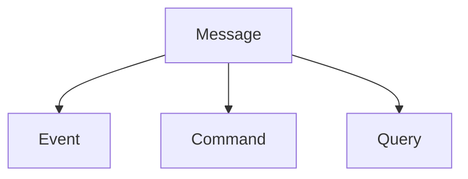
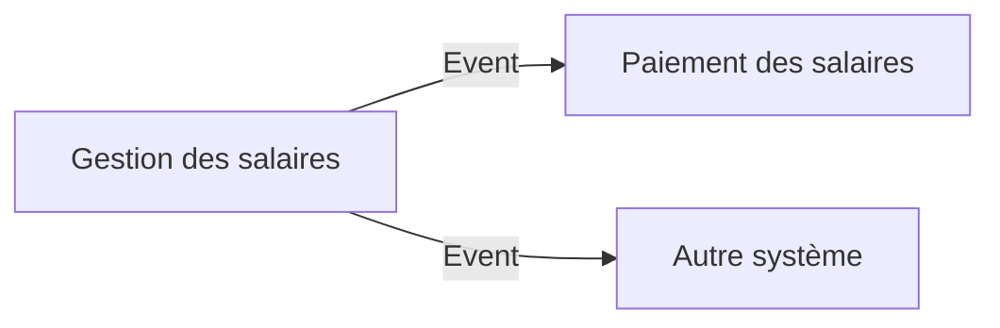
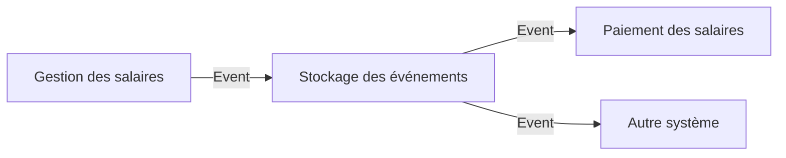
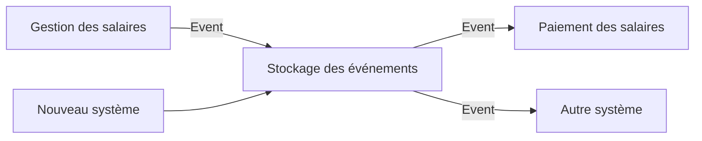

# Building Event-Driven Microservices

Cette documentation s'inspire largement du livre [Building Event-Driven Microservices](https://www.oreilly.com/library/view/building-event-driven-microservices/9781492057881/) de Adam Bellemare et des conversations eu avec des collègues et amis.

## Definition des concepts

Avant d'entamer le processus de construction d'une architecture orientée événements, il est important de définir les concepts de base qui seront utilisés. La définition des concepts permet de comprendre ce que l'on fait et pourquoi on le fait. Autrement dit, à quoi répondent les concepts liés à l'architecture orientée événements et comment le font-ils.

### Domain Driven et Bounded Context

- **Domaine** : Le domaine définie l'ensemble des concepts, des règles métier et des entités qui sont liées entre elles et qui définissent un certain contexte métier.
- **Sous-domaine** : Un sous domaine est un sous-ensemble spécifique du domaine qui se concentre sur un aspect particulier du domaine global..
- **Modèle** : Le modèle est une représentation abstraite et simplifiée du domaine et des sous-domaine qui est utilisée pour répondre aux fonctionnalités de ce domaine.
- **Bounded context** : Le _bounded context_ est une frontière conceptuelle dans laquelle un modèle spécifique est défini et maintenu, de même que les processus, les événements, les règles métier et les entités qui sont liées à ce modèle et pertinent pour un ou plusieurs sous-domaines.

Les notions de domaine et bounded context sont des concepts qui peuvent se confondre. La où le domaine est lié à un métier, le bounded context est lié à la modélisation d'un processus métier. Par conséquent un bounded context peut être associé à un ou plusieurs sous-domaines. Les modèles seront alors adaptés pour répondre aux besoins du bounded context.

### Message vs. Event

Un message est une unité de communication entre systèmes distribués. Il contient toutes les données utiles au traitement d'une tâche. Dans une représentation orientée objet, un message serait la classe abstraite qui contient les attributs de bases pour faire transiter des informations d'un système à un autre. Un des attributs définirait le type de message (ex: Command, Event, Query, etc.).

Un événement est une spécification du message. Il est utilisé pour notifier les autres systèmes d'un changement d'état. Il est considéré comme suffisant, c'est-à-dire qu'il contient toutes les informations nécessaires pour être traité par les systèmes qui le reçoivent.

Dans tous les cas, le message et plus spécifiquement l'event est le lien, le seul point de cohésion, entre les systèmes. Il est dés lors primordial de bien les définir, les documenter et les valider de manière à éviter les erreurs d'interprétation.

### Communication et Data Driven

Le _D_ de _Driven_, que ce soit pour le TDD (Test Driven Development), le DDD (Domain Driven Development), etc.,  défini qui est le moteur de la conception.

L'_Event Driven Architecture_ se construit autour des événements. Par conséquent, dans le processus de conception, l'identification des événements est la première étape (_Event Storming_).

Ces événements vont soit être utilisés pour faire communiquer les systèmes entre eux (_Communication Driven_), soit vont être stockés comme une donnée à part entière et consommée par une application (_Data Driven_).

Cette différence est fondamental pour la conception de l'architecture orientée événements, car la réponse technique est différente en termes de topologie, de stockage, de distribution, etc.

#### Communication Driven

Dans le cas d'une _Communication Driven_, les événements sont utiles pour **communiquer** et sont utilisés pour notifier les autres systèmes d'un changement d'état de manière asynchrone.

Par exemple, lorsque l'application de calcule des salaires termine le traitement de génération d'un lot de virement à effectuer, il envoie un événement pour notifier le système de paiement que le lot est prêt à être traité. Celui peut alors récupérer le lot et créer les paiements associé.

La réponse technique implique une distribution des événements aux systèmes qui en ont besoin, c'est-à-dire, une approche _publish-subscribe_. Ce paradigme ne nécessite pas de stockage centralisé des événements.

Chaque système est responsable de la gestion des événements qu'il reçoit et stocke les informations utiles pour son traitement. Les données sont gardées et le cas échéant dupliquées dans chaque système qui en a besoin.

Selon les cas, il peut être nécessaire de déterminer des systèmes maîtres (_single source of truth_) de la données pour éviter les incohérences.

#### Data Driven

La construction des systèmes s'articulent autour des **données** et plus spécifiquement des événements. Sur base de ceux-ci, les microservices vont pouvoir exécuter des traitements et produire eux-mêmes des événements qui seront stockés et mis à disposition.

Dans ce contexte, les événements sont stockés dans des zones de stockage centralisées. Dès lors, la production des événements est dissociée de leur stockage et accès.

Pour reprendre l'exemple précédent, l'application de gestion des salaires va produire un événement qui sera stocké dans une zone de stockage centralisée. Le système de paiement va alors consommer cet événement pour traiter le lot de paiement.

Ce type d'architecture introduit également la notion de _single version source of truth_ qui est la source de vérité pour les données. Cela permet de garantir que les données sont cohérentes et que les systèmes qui les consomment ont accès à la dernière version des données. Dans ce cas la _single version of truth_ est l'event stream.

Une différence fondamentale est que, par le biais de mécanisme natif aux différents outils de stockage des événements, un nouveau système va pouvoir consommer les événements passés et ainsi se mettre à jour.

### Event Broker

Un Event Broker est un composant logiciel qui permet de distribuer les événements aux différents systèmes qui en ont besoin.

Fondamentalement, il existe deux types de topology pour les architectures orientées événements :

Vous pouvez retrouver les différents chapitres de la documentation suivants :

### Event Stream

#### Consumer Group

> :construction: **TODO**

#### Unkeyed Event : événement sans clés

> :construction: **TODO**

#### Keyed Event : événement à clés

> :construction: **TODO**

#### Entity Event : événement d'entité

> :construction: **TODO**

import DocCardList from '@theme/DocCardList';

<DocCardList />