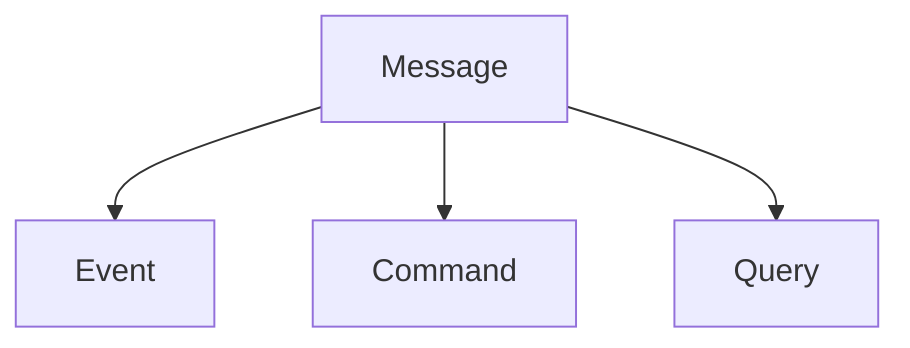

# Building Event-Driven Microservices

Cette documentation s'inspire largement du livre [Building Event-Driven Microservices](https://www.oreilly.com/library/view/building-event-driven-microservices/9781492057881/) de Adam Bellemare

## Definition des concepts

Avant d'entamer le processus de construction d'une architecture orientée événements, il est important de définir les concepts de base qui seront utilisés. La définition des concepts permet de comprendre ce que l'on fait et pourquoi on le fait. Autrement dit, à quoi répondent les concepts liés à l'architecture orientée événements et comment le font-ils.

### Message vs. Event

Un message est une unité de communication entre systèmes distribués. Il contient toutes les données utiles au traitement d'une tâche. Dans une représentation orientée objet, un message serait la classe abstraite qui contient les attributs de bases pour faire transiter des informations d'un système à un autre. Un des attributs définirait le type de message (ex: Command, Event, Query, etc.).

Un événement est une spécification du message. Il est utilisé pour notifier les autres systèmes d'un changement d'état. Il est considéré comme suffisant, c'est-à-dire qu'il contient toutes les informations nécessaires pour être traité par les systèmes qui le reçoivent.

### Event Broker

Un Event Broker est un composant logiciel qui permet de distribuer les événements aux différents systèmes qui en ont besoin.

Fondamentalement, il existe deux types de topology pour les architectures orientées événements :

Vous pouvez retrouver les différents chapitres de la documentation suivants :

import DocCardList from '@theme/DocCardList';

<DocCardList />