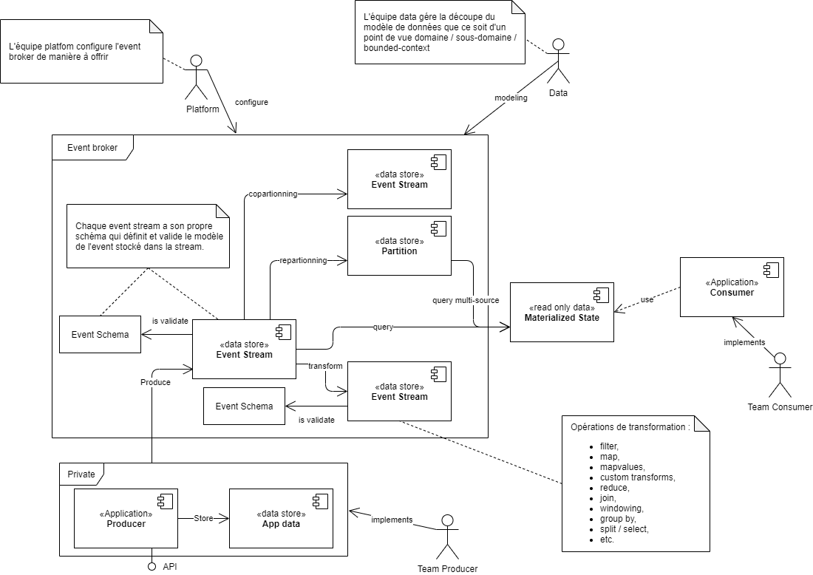

Pourquoi choisir une architecture événementielle avec une _event stream_ ? De manière globale, l'implémentation d'un flux de données (_streaming_) dans une entreprise permet de répondre à besoins de :

- Disposer de données de manière rapide, avec une latence faible.
- Organiser, traiter et stocker une quantité de données presque infinie en temps réel.

Autrement dit, lorsque la question se pose de comment consommer et traiter une quantité de données presque infinie de manière efficace, rapide et cohérente, la réponse est de mettre en place un flux de données (_streaming_). Ceci peut d'ailleurs être repris comme une des définitions du streaming.

## Single Source of Truth (SSOT) et Single version of the truth (SVOT)

Ces deux principes sont souvent utilisés pour décrire l'objectif d'une architecture événementielle avec un flux de données.

Le _single source of truth_ (SSOT) va définir un seul endroit d'où les données peuvent être consommées, tandis que le _single version of the truth_ (SVOT) va définir une seule version de la donnée que ce soit en termes de format ou de contenu.

Dans le cadre d'une architecture distribuée et plus spécifiquement événementielle, le principe SVOT va permettre de garantir que les données sont mises à disposition de manière à donner une image unique (non redondante), cohérente et à jour. Il peut s'agir de l'_event stream_ lui-même ou d'une vue matérialisée des données (ayant plusieurs _event stream_ comme sources).

En outre le SSOT va permettre de garantir que les données sont disponibles de manière centralisée à un seul endroit. Les données peuvent être néanmoins copiées et dupliquées dans des vue matérialisées (_materialized state_) qui sont accessibles en lecture seules.

## Event Stream

L'une des pistes de mise en place d'une architecture microservices est de mettre en place un flux de données entre les différents services. Cela permet de déclencher des actions en fonction des événements qui se produisent dans le système.

Ces événements sont stockés dans des _event streams_ qui sont des flux de données immuables et ordonnés.

### Production vs Consommation

La mise en place d'un _event stream_ va permettre de séparer la production des événements de leur consommation. Cela permet de déconnecter les différents services et de les rendre indépendants les uns des autres (_point to point coupling_). En outre, les applications productrices n'étant plus en charge de la mise à disposition des données, elles peuvent se concentrer sur leur métier et ne pas être impactées par les problématiques liées à la consommation, notamment la performance.

#### Couplage de la production et de la consommation

Dans une architecture classique, la production et la consommation des événements sont couplées au sein d'une même application. L'application va utiliser une couche de persistance pour stocker des données et une couche de consommation pour lire ces données. Au mieux ces deux couches sont séparées (par exemple en utilisant des vues matérialisées) mais elles restent au sein d'une même application.

#### Découplage de la production et de la consommation

Dans une architecture événementielle avec une _event stream_, la production et la consommation des événements sont découplées. Les événements sont produits par une application et consommés par une autre application. Les événements sont stockés dans un _event stream_ qui est un flux de données.

Les applications productrices n'ont plus à se soucier de la consommation des événements en offrant API spécifique et peuvent se concentrer sur leur métier.

Les applications consommatrices n'ont plus à se soucier de la production des événements et vont chercher les données dans une zone centralisée. Les applications productrices et consommatrices sont donc indépendantes les unes des autres.

#### Organisation des équipes

La gestion des _event streams_ peut être confiée à une équipe dédiée qui va mettre en place les _event streams_ et les _materialized state_ en fonction des besoins des applications consommatrices. Il est important de noter que cette équipe peut vite se retrouver submergée par la demande des différentes équipes, celle-ci doit donc être de taille suffisante pour répondre à la demande.

## Les données d'un Event Stream

La gestion des données dans un _event stream_ est un point clé de l'architecture événementielle, car il est le seul point de couplage entre les différentes applications. Par conséquent, chaque changement dans le format des données aura un impact sur l'ensemble des applications consommatrices.

> :pencil: **Note** : Il existe trois [types d'événements](../1-definition-des-concepts.md#types-dévénements) : les événements sans clé (_keyless event_), les événements avec clé (_keyed event_) et les événements d'entité (_entity event_).

:construction: **En construction** : Cette section est en cours de rédaction.

### Validation du schéma

:construction: **En construction** : Cette section est en cours de rédaction.

## Stream Processing

En fonction des framework et des outils utilisés, il est possible de mettre en place des mécanismes de transformation des données pour créer de nouvelles stream adaptées aux besoins des applications consommatrices.

### Copartitioning

:construction: **En construction** : Cette section est en cours de rédaction.

### Repartitioning

:construction: **En construction** : Cette section est en cours de rédaction.

### Opération de transformation

:construction: **En construction** : Cette section est en cours de rédaction.

## Materialized State

De même que des _materialized state_ qui permettent une lecture des données multi sources dans un format de table SQL adapté à l'application consommatrice.

:construction: **En construction** : Cette section est en cours de rédaction.

## Exemple 2 : Cascade d'opération

- Résilience
- Retry & Idempotence
- Transaction
- Condition de concurrence
- Rollback
- Sortie de la cascade

## Exemple 3 : Sequence d'événements

- Ordre
- Windowing
- Late arrival

## Exemple 4 : Consultation de données en masses