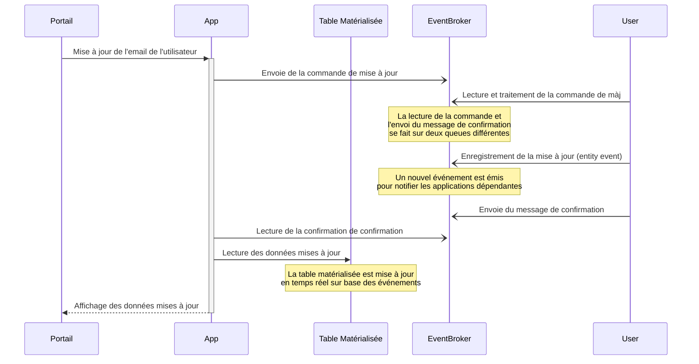
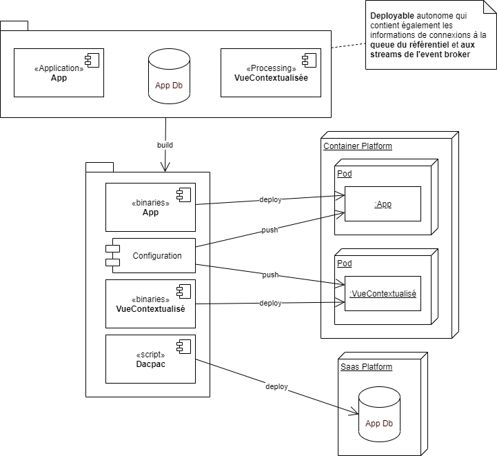

Prenons le cas d'une mise à jour d'une adresse mail, où une application `App`, dédiée à une gestion spécifique, doit modifier une donnée dont elle n'est pas maître, en l'occurrence l'adresse mail (`email`) d'un utilisateur (`User`).

L'entité `User` est géré au sein d'un référentiel de données centralisé de manière à pouvoir concentrer les fonctionnalités associées à la gestion d'un utilisateur, ainsi que de distribuer les informations au travers de l'entreprise (entité transversale).

Le modèle de donnée l'application `App` fait référence aux utilisateurs et intègre, par conséquent, une partie des attributs de l'entité transversale dans son propre modèle.

Le diagramme ci-dessous montre le processus de mise à jour de l'adresse mail d'un utilisateur, où l'application `App` envoie une commande de mise à jour de l'adresse mail au référentiel de données, qui traite la commande et renvoie un message de confirmation à l'application `App`. Une fois le message de confirmation reçu, l'application `App` met à jour son propre modèle de données avec la nouvelle adresse mail de l'utilisateur lu sur une table matérialisée mise à disposition par l'_event broker_.

> :memo: **Note** : Il pourrait être tentant de ne pas passer par le référentiel de données pour mettre à jour l'adresse mail de l'utilisateur et de communiquer directement avec l'_event stream_. Néanmoins, il est important de garder à l'esprit que l'_event stream_ n'est pas un _database_ et ne doit pas être utilisé comme tel. En effet, l'_event stream_ est un flux de données qui permet de distribuer des événements entre différentes applications, mais il n'est pas conçu pour implémenter des logiques métiers complexes. Par conséquent, il est préférable de passer par le référentiel, qui contiendra toutes les règles métier pour mettre à jour l'adresse mail de l'utilisateur.

> :memo: **Note** : Le type d'événement stocké dans la stream `User` est un _entity event_ qui permet de stocker l'ensemble des attributs de l'entité `User` et de garantir que les applications consommatrices disposent de l'ensemble des informations nécessaires pour effectuer les traitements. Néanmoins, il est possible de stocker un _keyed event_ qui ne contient que l'identifiant de l'utilisateur et l'adresse mail dans un autre stream, mais dans ce cas, il est nécessaire d'extraire les informations de plusieurs _event stream_.

## Étape 1 : La commande

La première étape consiste à envoyer une commande de mise à jour de l'adresse email au référentiel maître de ces données.

Dans ce contexte, `App` connaît l'application maître de la donnée `User` et elle connaît également le contrat de service qui permet de modifier l'email. Il s'agit d'une approche [orienté communication](../1-definition-des-concepts.md#implémentation-orientée-communication-communication-driven), où l'objectif est de faire passer un message d'une application à une autre. Généralement dans ce cas de figure, l'application appelante ne s'attend pas à une réponse immédiate, mais à une réponse asynchrone, une fois que la commande a été traitée. Ici, la commande est envoyée au référentiel de données pour être traitée et attend une confirmation de traitement.

L'envoi de la commande peut être fait en asynchrone via une _queue_, ou via une API REST. Le désavantage de l'API REST est de garder un lien "point à point" entre le référentiel est l'application `App` et par conséquent un couplage fort. Au contraire de l'envoi de la commande via une _queue_, qui permet de déconnecter les deux applications. Attention néanmoins que ce découplage est technique et non fonctionnel, car fonctionnellement, il s'agit bien de modifier la valeur d'un attribut au sein du référentiel. Par conséquent, l'application `App`, reste dépendante du référentiel pour la mise à jour de l'adresse mail.

> :memo: **Note** : Le couplage fort signifie que, si le référentiel tombe en panne, ne serait-ce que pour une courte durée, l'application `App` ne pourra plus fonctionner. Cela peut être un problème si l'application `App` est critique pour l'entreprise.
>
> :construction: **En construction** : Ajouter les détails concernant le frontend.

### Context Mapping

Dans le diagramme _figure 3 - exemple de mise à jour d'une adresse mail_ on distingue clairement une différence entre le contrat de service de l'application `App` et celui du référentiel de données. En effet, l'application `App` permets de mettre à jour l'adresse email d'un utilisateur grâce au service `updateUserEmail` qui prend en paramètre l'identifiant de l'utilisateur et la nouvelle adresse email. Tandis que le référentiel de données permet de mettre à jour un utilisateur grâce au service `updateUser` qui prend en paramètre un utilisateur.

Le passage d'un périmètre à l'autre s'appelle le **Context Mapping** et définit la manière dont les données sont traduites d'un contexte à un autre. L'architecture hexagonale permet de définir une séparation claire entre le domaine de l'application (_domain_)et les dépendances externes (intégrer grâce aux _ports_ et _adapters_).

Le diagramme ci-dessous montre l'adaptateur de sortie qui permet de communiquer avec le référentiel de données pour envoyer la commande de mise à jour de l'adresse mail et qui se charge de faire la conversion entre les deux périmètres fonctionnels et les deux modèles de données.

De cette manière, à aucun moment le domaine de l'application `App` ne devra être adapté à un changement d'architecture d'une dépendance, en l’occurrence ici : le référentiel. Seul l'adaptateur est en charge de l'intégration et va donc être modifié. Néanmoins, il est important de noter que le service de mise à jour de l'utilisateur offert par le référentiel, ne peut en aucun obligé l'application `App` à passer l'ensemble des attributs de l'utilisateur pour une simple mise à jour de l'adresse mail. En effet, dans le cas contraire, l'adaptateur devrait d'abord récupérer l’entièreté des attributs de l'utilisateur, pour ensuite les renvoyer au référentiel avec la nouvelle adresse mail. Ce qui est une perte de performance et de ressource inutile. Une solution serait de découper le service de mise à jour de l'utilisateur en plusieurs services plus fins, qui permettent de mettre à jour un attribut spécifique de l'utilisateur (cf. [Queue](#queue)).

### Queue

Dans l'exemple de la figure 3, l'envoi de la commande de mise à jour de l'adresse mail est fait au travers d'un _queue_ qui permet de mettre à jour un utilisateur "tout entier". Selon les principes DDD, ce type de découpe pose un problème de granularité, car il n'est pas possible d'identifier quelle est la véritable action, au sens métier, qui est réalisé. En effet, la mise à jour de l'adresse mail est une action métier qui doit être identifiée comme telle, or du côté du référentiel, il s'agit d'une mise à jour de l'utilisateur.

Par conséquent, il serait préférable de découper le service de mise à jour de l'utilisateur en plusieurs services plus fins, qui permettent de mettre à jour un attribut spécifique de l'utilisateur. De cette manière, il sera également plus facile de comprendre les actions métiers qui sont réalisés, a fortiori dans un environnement distribué. Le cas échéant, les différentes applications distribuées pourront logger des informations plus précises et par conséquent, l'audit et le débogage seront facilités.

> :construction: **Todo** : Expliquer comment une _queue_ orienté métier va favoriser le traitement des _events late arrival_.

Néanmoins cette approche peut être plus complexe à mettre en place, car dans le pire des cas, une _queue_ est nécessaire pour chaque attribut de l'utilisateur, et l'application cliente devra envoyer autant de messages qu'elle modifie d'attribut. Il est donc important de trouver un juste milieu entre la granularité des services et la complexité de l'architecture.

### Gestion des erreurs

> :construction: **Todo** : Intégrer la gestion des incidents de production lorsqu'un message tombe en DLQ et reprendre les erreurs sur base de ce qui peut arrivé : le traitement de la commande n'est pas possible parce que la data est mauvaise, il y a une erreur métier prévue, il y a une erreur dans le traitement non prévue, la _queue_ n'est plus disponible, le référentiel n'est plus disponible, l'application `App` tombe en timeout.

#### Erreur de communication

Grâce au mécanisme de _queue_, il est possible de gérer les erreurs de communication entre l'application `App` et le référentiel. En effet, si le référentiel est en panne, l'application `App` peut continuer à envoyer des commandes de mise à jour de l'adresse mail, sans que celles-ci soient perdues. Une fois le référentiel de nouveau disponible, il pourra traiter les commandes en attente.

De même, si le référentiel se trouve dans un état dégradé et qu'il n'est plus en mesure de traiter les commandes, le mécanisme de _queue_ permet de mettre en place un système de _retry_ qui va tenter de renvoyer la commande de mise à jour de l'adresse mail à intervalle régulier.

Le cas échéant, si le référentiel ne peut pas traiter la commande, il est possible de mettre en place un système de _dead letter queue_ qui permet de stocker les commandes qui n'ont pas pu être traitées.

Dans le cas où le référentiel n'a pas pu traiter un message pour des raisons techniques (downtime, coupure réseau, etc.), les messages en _dead letter queue_ pourront être rejoués. Attention toutefois à bien garantir l'ordre et s'assurer que les messages n'ont pas expiré, par exemple si l'adresse mail n'a pas été re-modifié entre-temps.

Dans le cas où le référentiel ne peut pas traiter la commande pour des raisons non techniques, mais inhérentes à l'implémentation (donnée incohérente, bug, etc.), une enquête ainsi qu'une opération manuelle, devra être envisagée pour corriger le problème et re-traiter la commande.

En tous les cas, le référentiel doit être capable de gérer les erreurs de communication et de renvoyer un message d'erreur à l'application `App` si la commande de mise à jour de l'adresse mail n'a pas pu être traitée (cf. [Etape 2 : Le traitement](#étape-2--le-traitement)).

#### Timeout dans le traitement de la commande

Il se peut que la commande de mise à jour mette plus de temps à être traitée que prévu. Si le [traitement](#étape-2--le-traitement) tombe en erreur, il est possible que le message tombe en _dead letter queue_ après plusieurs _retry_ et que l'application `App` ne soit notifiée de l'erreur que tardivement. Dans ce cas l'application `App` ne doit pas attendre indéfiniment la réponse du référentiel, mais doit mettre en place un mécanisme de _timeout_. De même, l'application `App` ne doit pas effectuer de _retry_ au risque de renvoyer une commande de mise à jour de l'adresse mail identique à celle qui n'a pas pu être traitée, et ce de manière infinie.

> :warning: **Attention** : Ce mécanisme doit également être prévu dans les couches frontend de l'application `App`, par exemple en bloquant l'interface pendant un temps défini.

## Étape 2 : Le traitement

Une fois la commande parvenue au référentiel, par le biais de la _queue_, celui-ci va la traiter et mettre à jour l'adresse mail de l'utilisateur dans l'_event stream_.

Il s'agit maintenant d'une [communication orientée donnée](../1-definition-des-concepts.md#types-dévénements). En effet l'application va mettre à jour la donnée sans prendre en compte les applications qui en sont dépendantes. Dès lors, un événement sera émis et les applications dépendantes seront notifiées de manière à effectuer les traitements nécessaires, le cas échéant.

Dans l'exemple qui nous concerne, la mise à jour est assez simple et ne demande que très peu de logique métier. Néanmoins, la donnée doit être validée avant d'être mise à jour, ne serait-ce que pour vérifier que l'adresse mail est dans un bon format.

> :memo: **Note** : La validation du format de la donnée peut être faite à tout niveau de la chaîne. En effet, un format (date, email, montant, etc.) est généralement le même pour toutes les applications et peut, par conséquent, être implémenté partout de la même manière, souvent par le biais d'une librairie partagée. Néanmoins, même si la validation du format se fait en amont du référentiel, celui-ci à la responsabilité de vérifier la validité des données qui lui sont envoyées, format y compris. Donc, même si le format est vérifié en amont par les "clients", le référentiel va quand même faire une validation de la donnée et renvoyer un résultat de traitement de mise à jour.

### Request-Reply

Dans le cas d'une mise à jour de données, il est souvent nécessaire de renvoyer un résultat à l'application qui a envoyé la commande. Cela permet de garantir que la commande a bien été reçue et traitée. Dans le cas d'une _queue_, il est possible de mettre en place un mécanisme de _request-reply_ qui permet de renvoyer un message de confirmation (_reply_) à l'application `App`.

Néanmoins, il est important de noter que le mécanisme de _request-reply_ peut être complexe à mettre en place, notamment dans un environnement distribué. En effet, il est nécessaire de garantir que le message de confirmation est bien envoyé et reçu par la bonne instance de l'application `App`. De plus, il est nécessaire de gérer les cas d'erreurs, notamment si le message de confirmation n'est pas reçu.

Le diagramme ci-dessous montre le mécanisme de _request-reply_ qui permet de renvoyer un message de confirmation à l'application `App` une fois la commande de mise à jour de l'adresse mail traitée.

Ce qui est important de comprendre c'est que le message de confirmation est envoyé par le référentiel, sur une _queue_ **temporaire**, créé par l'instance qui a envoyé la commande, et uniquement dédié à cette instance. Autrement dit l'instance qui a envoyé la commande est la seule à pouvoir lire le message de confirmation. En outre, la _queue_ temporaire est supprimée une fois le message de confirmation lu.

> :memo: **Note** : Il pourrait être envisagé de supprimé la ou les _queue_ temporaire une fois l'instance de l'application `App` déchargée de la mémoire. L'instance de l'application `App` aurait alors un pool de queue temporaire, ou chaque queue serait créée à la demande et supprimée une fois l'instance déchargée de la mémoire.
>
> :memo: **Note** : Ce type de mécanisme permet de garantir la scalabilité de l'application `App`, car chaque instance de celle-ci va créer sa propre _queue_ temporaire pour recevoir le message de confirmation.
>
> :warning: **Attention** : Il est nécessaire de spécifier l'identifiant de la _queue_ temporaire au référentiel pour qu'il puisse envoyer le message de confirmation sur la bonne _queue_.

### Augmentation de la charge

Le mécanisme de _queue_ permet la scalabilité tant pour l'application `App` que pour le référentiel :

- L'application `App` va multiplier ces instances et envoyer ces messages vers la _queue_.
- Le référentiel va multiplier ces instances pour traiter les commandes en parallèle et garantir que les commandes sont traitées dans l'ordre d'arrivée dans un temps raisonnable.

> :memo: **Note** : Dans ce cas, le mécanisme de request-reply expliqué précédemment est toujours valable, car chaque instance de l'application `App` va créer sa propre queue temporaire pour recevoir le message de confirmation (_reply_) et envoyer l'identifiant de la queue.

## Étape 3 : Affichage des données mises à jour

Une fois le traitement terminé et le message de confirmation reçu, l'application `App` peut mettre à jour son propre modèle de données afin de renvoyer l'email mis à jour au portail de manière à être affiché.

:construction: **En cours de rédaction** : Les données sont injectées dans une table au sein de la même base de données que l'application `App`. Cette table est mise à jour en temps réel sur base des événements émis par l'_event broker_. Les données peuvent donc être lues et jointes à d'autres tables pour être affichées sur le portail.

### Table matérialisée

L'_event broker_ permet de mettre à disposition des données sous forme de tables (_materialized table_) qui sont mises à jour en temps réel (sur base des événements). Ces tables sont construites à partir d'un ou plusieurs _event streams_ et permettent d'offrir un sous-ensemble de données utiles pour une application spécifique (_query_).

Il existe deux moyens pour l'_event broker_ de mettre à disposition des données : les tables internes ou les tables externes.

#### Table interne

Les tables internes offrent l'énorme avantage de pouvoir être construire en même temps que l'instance de l'application, car elles y sont directement associées, ce qui d'un point de vue de la scalabilité est un avantage. En effet, chaque instance de l'application `App` peut avoir sa propre table interne mise à jour en temps réel. Cependant, la mise en route de la table interne peut prendre un certain temps provoquant un délai (_downtime_) avant que l'application ne soit pleinement opérationnelle.

Dans un certain cas de figure, lorsque la totalité des données est divisée en plusieurs tables internes (_partition_) et par conséquent sur plusieurs instances, chaque requête doit être routée sur la bonne instance. Ce mécanisme est transparent pour l'application, et permet d'alléger le flux de récupération grâce à la répartition de la charge sur plusieurs instances. Néanmoins, ce mécanisme de routage ajoute une certaine complexité en termes de topologie infra, de même qu'un certain coût en termes de performance dû à la nécessité de router (quasi) toutes les requêtes.

> :memo: **Note** : La chance de tombé sur la bonne instance de l'application `App` est de `1/n` avec `n` le nombre d'instance de l'application `App`. Par conséquent au plus le nombre de d'instance est grand, au plus la chance de tomber sur la bonne partition est faible et dès lors de devoir router la requête vers une autre partition.

En outre, toujours dans le cas où les données sont partitionnées, cette technique est sensible au mécanisme de re-balancement des partitions. Dans ce cas, les _consumer group_ doivent être mises à jour pour prendre en compte les modifications, ce qui peut provoquer un léger _downtime_.

> :warning: **Attention** : Dans le pire des cas, il peut avoir des problèmes de _race condition_ si ce mécanisme n'est pas parfaitement géré.

> :memo: **Note** : Une partition est associée à une (ou plusieurs) clé. Cette information est connue du _consumer group_. Celui-ci permet d'associer une instance à une (ou plusieurs) partition, donc par extension, une instance est associée à une (ou plusieurs) clé. Par conséquent, chaque instance, à l'aide de sa connaissance de l'algorithme de redistribution, connaît sa (ou ses) propre clé, mais également celle(s) de ses voisins. Dès lors chaque instance est en mesure de router une requête sur la bonne instance.
>
> :warning: **Attention** : Une instance peut être associée à plusieurs partitions, mais une partition ne peut être associée qu'à une seule instance. Par conséquent, il n'est pas possible de mettre à l'échelle une instance sur une même partition. Le seul moyen de mettre à l'échelle est de re-partitionner les données. Au maximum, on pourrait avoir autant de partitions qu'il existe de clé, et autant d'instance qu'il existe de partition : 1 clé -> 1 partition -> 1 instance.

#### Table externe

Les tables externes offrent l'avantage de pouvoir être construite en dehors de l'instance de l'application, ce qui permet de les partager entre plusieurs applications et de découpler la table de l'instance de l'application. La gestion des tables devient donc plus facile, car il est possible de mettre à jour le _data model_ sans avoir à redémarrer les instances des applications consommatrices. En outre, il n'est plus nécessaire de router les requêtes, car la table externe est accessible par toutes les instances de l'application.

Néanmoins, étant une ressource partagée, elle représente un goulot d'étranglement potentiel et ne peut pas être mise à l'échelle de la même manière que les tables internes.

#### Quel type de table choisir ?

En conclusion, le choix entre une table interne et une table externe dépend de la manière dont les données sont utilisées :

- **Table interne** : Si les données doivent être mises à disposition dans le cadre d'une utilisation **très** intensive, alors une table interne est préférable. Mais cette option doit être utilisée avec précaution, car elle peut être difficile à mettre en place et à maintenir, surtout s'il existe une instance par partitions, avec un très grand nombre de partitions.

- **Table externe** : Si les données sont partagées entre plusieurs applications et qu'elles doivent être mises à jour fréquemment, alors une table externe est préférable. Mais il faut également s'assurer que la charge sur la table externe ne devienne pas un goulot d'étranglement.

Dans le cas qui nous concerne, la table matérialisée externe est une solution suffisante. D'ailleurs, cette solution sera la plus adéquate dans la plupart des cas.

On peut observer que la différence entre les deux approches se situe surtout au niveau de la découpe, que ce soit en termes d'implémentation ou de gestion de plateforme (Ops) ou encore d'infrastructure. Par conséquent, le passage d'une architecture à l'autre peut se faire relativement facilement, en ce sens qu'il ne demande pas de changement majeur dans le code de l'application, à condition que les principes de bonnes pratiques soient respectés.

## Étude stratégique de l'architecture

L'architecture tant à apporter des solutions aux problèmes de performances, de couplage fort, de scalabilité, de gestion des erreurs et de complexité. Des stratégies sont dès lors mises en place pour garantir le bon fonctionnement de l'ensemble des systèmes.

### Dépendance

Seul le modèle de donnée reste le véritable point de couplage technique et fonctionnel, inévitable, entre les composants. Ce qui présente un avantage face aux architecture qui favorise les couplages point à point via des REST Api. Par conséquent, seules les modifications du modèle de données impactantes (_breaking_) auront des répercutions, mais uniquement avec les systèmes qui l'utilisent.

La _queue_, dans la phase d'envoie de commandes au référentiel, permet d'avoir un découplage technique entre les composants `App` et `User`, mais d'un point de vue fonctionnel les deux applications reste dépendante l'une de l'autre. Dans ce cas, l'application appelante attend généralement une réponse asynchrone, avec une statut de l'opération. Cette aspect est un statut quo face aux autres architectures. La gestion des erreurs est également facilité par le mécanisme de _queue_ qui permet de stocker les messages en _dead letter queue_ et de les rejouer une fois le problème résolu. Néanmoins, elle demande une gestion particulière pour les frontend. Une solution envisagée serait de fournir un client intelligent (_smart client_) au travers de librairie qui gère la communication avec la _queue_ et qui permet de gérer les erreurs de manière uniforme à tout les niveaux de l'application. (cf. [Erreurs & pannes](#erreurs--pannes)).

Une autre opportunité d'un tel client serait que servant à faciliter la gestion du scénario [_request-reply_](#request-reply) avec la _queue_.

L'architecture hexagonale permet d'isoler les logique métier de l'application `App`. Par conséquent les composants sont résilients aux changements de l'infrastructure et des dépendances externes.

### Erreurs & pannes

Dans le cas, d'erreur ou de pannes du référentiel `User`, celui-ci doit être capable de renvoyer un message d'erreur à l'application `App` pour l'informer que la commande de mise à jour de l'adresse mail n'a pas pu être traitée. Les raisons de l'erreur doivent être clairement identifiées et renvoyées à l'application `App` pour qu'elle puisse les afficher à l'utilisateur.

Les commandes qui arrivent en _dead letter queue_ doivent être reconnues comme des incidents de production à prendre en charge en urgence. En effet, les messages laissés en suspend peuvent nuire à l'ordre d'arrivée des événements qui en découlent.

En outre, il s'agit clairement d'une rupture de contrat de service du système tiers et par conséquent doit être traité le plus rapidement possible pour éviter que ce problème ne se répète.

L'équipe qui enquête sur les causes du problème doit être en mesure d'accéder à tous les systèmes et toutes les données liées à l'incident, de manière à enquêter sur les causes du problème et le cas échéant lancer une procédure de réparation. Une fois la procédure de _retry_ manuel lancée, les événements de modification seront poussés sur l'_event broker_.

Des politiques de gestion de _late arrival event_ doivent être mis en place au sein de l'_event broker_ de manière à rejeter les événements périmé. Un événement est considéré périmé, quand un autre du même type est arrivé après lui. Dans ce cas, l'événement périmé doit être rejeté et un log doit être émis pour informer les équipes en charge de l'application. La conception du modèle des événements est primordiale pour cette étape de manière à bien identifier et comparer les mêmes opérations métier (cf. Modèle de données).

> :memo: **Note** : Dans certains cas, un événement même périmé peut avoir de la valeur et être traité. Par conséquent, la gestion des _late arrival event_ doit être étudiée en fonction du contexte métier.

L'application `App` a la "simple" responsabilité d'afficher les détails de l'incident, en spécifiant bien à l'utilisateur que son changement a été pris en compte, mais sera traité ultérieurement.

Des politiques de gestion d'erreurs peuvent être implémenté dans des librairies tant du côté frontend, que backend, pour gérer les erreurs de manière uniforme sur base de leur type : erreur technique, erreur fonctionnelle, erreur métier, etc. et faciliter l'intégration de la gestion des erreurs dans les applications (type d'erreur, message et affichage uniformisé).

### Performance

L'objectif de l'architecture est de garantir un temps de réponse raisonnable pour l'utilisateur. L'implémentation de communication asynchrone n'implique pas un allongement des temps de réponse. Par conséquent, et étant donnée que l'architecture reste relativement conventionnelle, les performances et les temps de réponses sont garanties.

Les composants sont simples et font de petites choses simples, dès lors les problématiques de performances ne sont pas inclues dans les développements (hormis les bonnes pratiques), mais relayé à la plateforme qui va augmenté ou diminué le nombre d'instance en fonction de la charge (cf. scalabilité).

La _queue_ peut facilement supporter une très grande quantité de messages et ne présente pas de risque dans ce cadre.

L'_event broker_ doit être dimensionné pour supporter une grande quantité d'opération, néanmoins cette configuration se fait pour tout l'event broker et non composants par composants, ce qui facilite le travail des opérateurs. Cependant, l'_event broker_ doit être le centre de toutes les attentions, car il est le point de passage d'un grand nombre de données et d'opérations.

Le mécanisme de _request-reply_ demande également une attention particulière, car il crée et supprime des _queues_ de manière dynamique. Cette opération est forcément consommatrice de ressource et doit être géré de manière à ne pas impacter les performances de l'application. Dans ce cadre, il est nécessaire d'avoir une solution ou un outil étudié spécifiquement pour ce cas de figure.

Les données sont injectées dans une table au sein de la même base de données que l'application `App`. Cette table est mise à jour en temps réel sur base des événements émis par l'_event broker_. Les données peuvent donc être lues et jointes à d'autres tables pour être affichées sur le portail, ce qui représente un gain de performance considérable en comparaison à la récupération des données depuis l'API d'une application. Néanmoins, il est nécessaire de s'assurer que la table matérialisée est correctement indexée pour garantir des temps de réponse optimaux. En outre, dans le cas où de nombreux événements sont émis, il est possible que la table matérialisée soit littéralement inondée de données, ce qui peut impacter les performances de l'application et éventuellement le serveur de base de données.

### Déploiement

#### Application `App`

Les packages de l'application `App` et du référentiel `User` sont autonomes et la construction des packages et peut s'intégrer complètement dans un processus automatique (CI). Par conséquent la planification de déploiement et de rollback peut se faire également de manière autonome, hormis dans le cas de modification impactante du modèle de données échangé sur la _queue_ ou, depuis les _stream_ de l'_event broker_.

> :memo: **Note** : Si le modèle de données de l'application `App` change et qu'il intègre de nouveaux attributs ou en supprime, il est nécessaire de mettre à jour le composant qui extrait les données de l'_event stream_ pour les injecter dans la base de données de l'application `App`. Néanmoins, ce composant faisant partie du package de déploiement de l'application `App`, il est possible de le mettre à jour en même temps que l'application. Le déploiement reste donc autonome et ne nécessite pas de coordination avec d'autres équipes.

#### Référentiel `User`

> :construction: **En cours de rédaction** : Appréhender l'idée de création d'une queue lors du déploiement et de la mise à jours de la configuration du référentiel lors de l'exécution de la pipeline de CD.

### Scalabilité

L'application `App` et le référentiel `User` sont scalable et pourront être mis à l'échelle automatiquement sur base de politique configuré sur la plateforme de containérisation.

L'_event broker_ offre des fonctionnalités comme le partitionnement, la répartition qui permettent de distribuer les données sur plusieurs _partition_ de manière à garantir la scalabilité des applications. Ces techniques permettent de répartir la charge sur plusieurs instances de traitement de l'information.

### Haute disponibilité

Pour évaluer la haute disponibilité d'un système, il faut imaginer l'impacte si celui-ci tombe en panne :

- L'impact d'une panne de l'application `App` est relative à l'importance métier des fonctionnalités qui y sont implémentés.
- En ce qui concerne le _message broker_, s'il vient à tomber en panne, l'application `App` ne serait plus en mesure d'envoyer un message et ne pourrait plus communiquer avec le référentiel `User` ce qui limiterait fortement les fonctionnalités disponibles de l'application.
- Dans le cadre du référentiel `User`, aucune application ne serait impactée d'un point de vu technique, c'est-à-dire qu'aucune application cesserait de fonctionner si le référentiel `User` tombe en panne. Néanmoins, dans notre cas, l'application `App` va fonctionner dans un mode dégradé où il lui sera impossible d'afficher les modifications "en temps réel" (dans un délai raisonnable), mais pourra encore néanmoins envoyer la commande de modification des données.

> :memo: **Note** : Généralement, un _message broker_ ne se limite pas à gérer quelques _queue_ et ce qui viendrait brisé les moyens de communication inter-applicatif et qui de surcroît, forcerait les applications appelantes à recommencer leurs opérations étant donné que les fonctionnalités de _retry_ et _dead letter queue_ ne seraient plus disponible.

### Modèles de données

L'application `App` possède sa propre base de données pour stocker le résultat de ces propres calculs.

Les données de l'utilisateur (`User`) et d'autres données sont injectées dans cette base de données grâce à un composant qui va extraire, sur base de _queries_, les données contenues dans les _event stream_. L'application `App` peut donc fonctionner de manière autonome sur base de son propre modèle de données, sans devoir accéder à des applications tiers pour lire des données.

L'_event broker_ est un _data store_ qui va conserver tous les évènements et leurs historiques à vie. Dans certains cas, les applications auront besoin de pouvoir parcourir l'historique, par exemple, dans notre cas, l'affichage de l'historique des modifications des emails avec l'utilisateur authentifié associé à cette modification.

Sur base des principes du _domaine-driven-design_ (DDD), les contrats de services sont découpés de manière à correspondre le plus possible aux opérations métiers. De cette manière, la traçabilité des opérations au travers des différents composants est facilité (audit, monitoring et diagnostique). En outre, ce type de découpe, permet une gestion plus fine des _late arrival event_ (cf. [Erreurs & pannes](#erreurs--pannes)).

L'_event broker_ peut être implémenté de sorte à intégrer des flux de données sur base d'opération simple comme : `join`, `filter`, `map`, `reduce`, etc. Ces opérations permettent de construire des _streams_ de données complexes à partir de _streams_ de données simples.

### Sécurité

Les informations de l'utilisateur authentifié sont transporté de composants en composants de manière à pouvoir appliquer les règles d'autorisation (RBAC).

Les données injectée en base de données depuis les _event streams_ doivent protégée contre l'écriture.

### Maintenance et évolution

C'est l'upgrade de version de l'_event broker_ qui aura le plus d'impacte, car c'est lui l'élément central de l'architecture. Ceci dit, tant que les modifications sont rétro-compatible, les applications n'auront pas besoin d'être modifiées.

Toute modifications du modèle de données échangé sur la _queue_ ou depuis les _stream_ de l'_event broker_ aura des impactes sur les applications qui les consomment. Néanmoins, ces modifications peuvent être gérées de manière à minimiser l'impacte sur les applications, notamment en mettant en place des architectures hexagonales, des librairies de communication, etc.

### Décommissionnement

Le décommissionnement des applications est simplifié, car la production des données est découplée de la consommation. Par conséquent, même si l'application disparaît, les données partagées sont toujours disponibles pour les autres applications.

Il est également envisageable de mettre en route des processus de libération de la données pour exporter les données d'une base de données (stand alone) vers le _data store_ de l'_event broker_

### Organisation

La charge de travail est redistribuée entre plusieurs équipe, ce qui permet à chacune d'entre-elle de se concentrer sur son propre domaine d'expertise se qui à tendance à augmenter la qualité du code et l'efficacité des développements.

Néanmoins plusieurs nouvelles responsabilités apparaissent : la gestion des containers et la gestion de l'_event broker_ et par conséquent, elles doivent être prises en charge par des équipes dédiées.

### Testabilité et qualité

Les tests end-to-end demandent une intégration avec le référentiel `User` disponible en environnement de développement et de tests. Ceci implique que la _queue_ utilisé pour les tests soit connue du référentiel et que les données soient bien envoyées sur la _queue_ de test.

| Type de tests | Application `App` | Référentiel `User` | _Queue_ `UserModified` | Base de données `App` | `VueContextualisé` | `EventBroker` |
|---------------|-------------------|--------------------|------------------------|----------------------|---------------------|---------------|
| Unitaire | Exécuté en local de la machine et lors du CI | N/A | L'intégration de la _queue_ doit être mocké | En local ou distante | N/A | N/A |
| Intégration | Exécuté en local de la machine ou déployé un environnement dédié | Déployé sur un environnement de test | Intégration de la _queue_ afin de garantir la validité du schéma de donnée | De préférence distante car éprouvé par l'équipe | Instance de test qui va lire les données des _streams_ impacté par la commande, de manière à vérifier la cohérence. | _Event Broker_ de tests impacté par la commande envoyé par l'application.  |

Les tests end-to-end sont exécuté dans un environnement le plus stable et le plus proche de la réalité possible.

### Ressources

Un membre de l'**équipe Platform** est nécessaire pour la création de la table matérialisée sur base de l'analyse des besoins, car les compétences sont spécifique. Un membre de l'équipe **data engineering** peut être associé de manière à garantir la pertinence des attributs sélectionnés.

### En résumé

L'architecture orienté événement avec event stream offre une grande flexibilité à bien des niveaux, mais demande une expertise plus poussée notamment concernant la gestion de l'event broker et est sensiblement plus complexe à mettre en place dû aux composants supplémentaires.

Néanmoins des solutions permettent de garantir une scalabilité et une maintenance plus aisée des applications et par conséquent une meilleure qualité de service, pour un coût de développement moindre.

#### Avantages

Les développements sont plus rapide, car beaucoup plus orienté fonctionnel :

- La queue et l'event broker présente l'avantage d'intégrer des fonctionnalités built-in tel que le _retry_ automatique, _dead letter queue_, _request-reply_, _late arrival event_, etc.
- La scalabilité est une responsabilité plateforme : plus besoin de gérer le nombre de threads, de connexions, etc.
- Les intégrations sont prises en charge par des librairies.
- Les modèles de données sont simples, orienté métier et associé à périmètre fonctionnel.
- L'architecture favorise le découplage des composants, mais également à l'intérieur des composants avec l'architecture hexagonale, les composants `Processing` qui construisent les tables matérialisées, etc.

La gestion infra est simplifié :

- Un event broker à dimensionné pour toute l'entreprise.
- Des politiques de scalabilité, de quota par type d'application.

La gestion des données est simplifié :

- Politique de gestion des données centralisée.

#### Inconvénients

- Vendor lock-in avec l'event broker pour toute l'entreprise car _single source of truth_.
- Nouvelles compétences et nouvelle équipe spécifique à acquérir pour la gestion de l'event broker.
- _Data libération_ (migration des données) vers le _data store_ de l'event broker de toutes les données partagées très conséquentes et complexe.

#### Tableau récapitulatif

Voici un tableau récapitulatif structurant les informations par chapitre, en distinguant les avantages et les inconvénients :

| **Chapitre**                    | **Résumé des idées développées**                                                                                                                                                                                | **Avantage/Inconvénient**                                |
|---------------------------------|----------------------------------------------------------------------------------------------------------------------------------------------------------------------------------------------------------------|----------------------------------------------------------|
| **Dépendance**                  | - Diminution du couplage, seul le modèle de données reste un point de couplage   - Découplage technique via _queue_, mais dépendance fonctionnelle persiste (inévitable).   - Standardisation de la gestion d'erreurs spécifiques en cas de panne ou d'erreur. (librairie partagée)   - Librairie pour faciliter les intégration avec les dépendances   - Architecture Hexagonale qui permet de limiter les modifications en cas de changement dans les dépendances externes             | Avantage                                             |
| **Erreurs & pannes**            | - Diminution des                                     | Avantage et Inconvénient                                             |
| **Performance**                 | - Avantage : Communication asynchrone sans allongement des temps de réponse (d'un point de vue utilisateur).   - Avantage : _Queue_ et _event broker_ dimensionnés pour haute performance.   - Inconvénient : Gestion complexe du _request-reply_.                             | Avantage et Inconvénient                                 |
| **Déploiement**                 | - Déploiement autonome pour `App` et `User`.   - Synchronisation requise en cas de changement du modèle de données.                                                                                          | Avantage                                |
| **Scalabilité**                 | - Scalabilité automatique basée sur la plateforme de conteneurisation.   - Partitionnement et répartition via l'_event broker_.                                                                              | Avantage                                                 |
| **Haute disponibilité**         | - Impact de pannes varie selon le composant   - Le référentiel `User` devient non-critique.                                                                                                   | Avantage                                 |
| **Modèles de données**          | - Application `App` autonome avec sa propre base de données.   - Distribution du modèle spécifique au besoin.   - Historique des événements conservé dans l'_event broker_.   - Granularité des des opérations fine.                                                                                  | Avantage                                                 |
| **Sécurité**                    | - Protection des données en base et gestion des autorisations (RBAC).                                                                                                                                           | Avantage                                                 |
| **Maintenance et évolution**    | - Inconvénient : Impact majeur de l'upgrade de l'_event broker_.   - Avantage : Rétrocompatibilité des modifications du modèle de données pour minimiser l'impact (nouvelle stream).                                                                     | Avantage et Inconvénient                                             |
| **Décommissionnement**          | - Simplification du décommissionnement grâce au découplage de la production et de la consommation des données.                                                                                                  | Avantage                                                 |
| **Organisation**                | - Redistribution de la charge de travail et nécessité de nouvelles compétences pour la gestion de l'_event broker_.                                                                                             | Avantage et Inconvénient                                 |
| **Testabilité et qualité**      | - Tests end-to-end nécessitent un environnement réaliste.   - Besoin de coordination pour les tests d'intégration avec la _queue_ `UserModified`.                                                            | Statut Quo avec possibilité d'amélioration                                |
| **Ressources**                  | - Expertise nécessaire pour la création de la table matérialisée.   - Avantages : développement rapide, gestion infra simplifiée, données centralisées.   - Inconvénients : _vendor lock-in_, nouvelles compétences requises, complexité de migration des données partagées.      | Avantage et Inconvénient                                 |