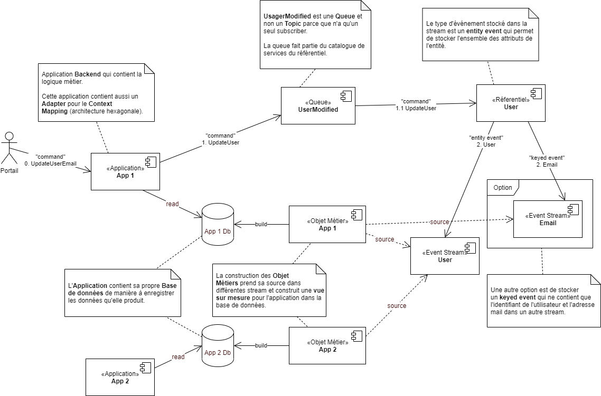
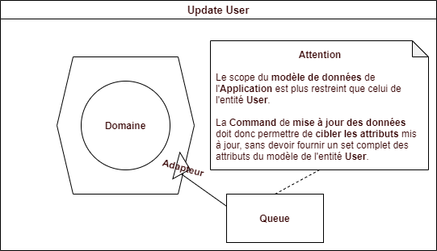
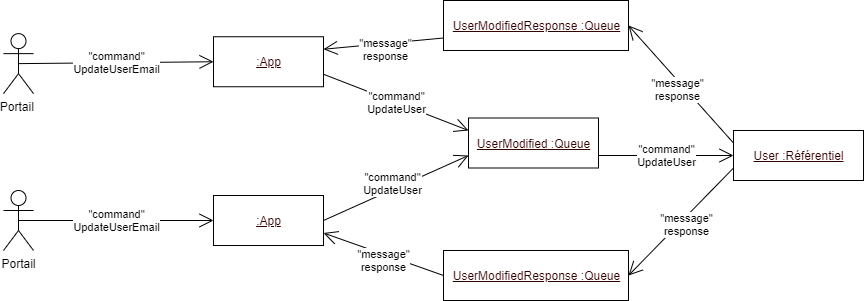
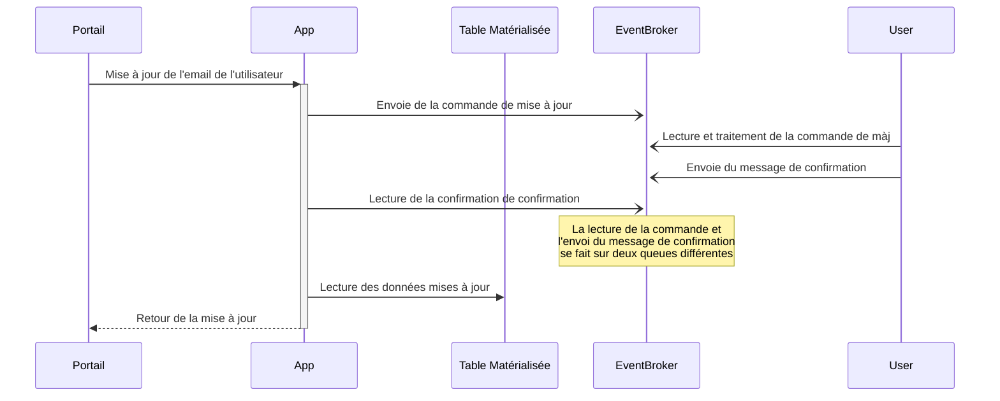
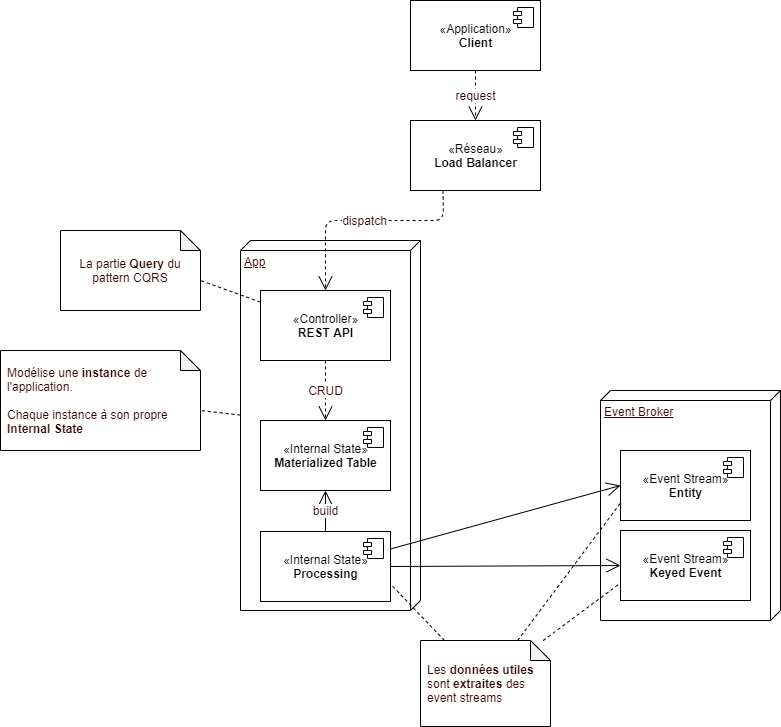
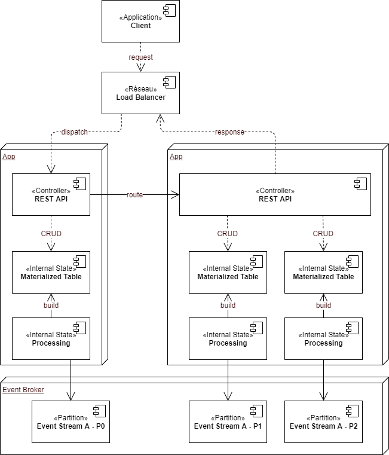
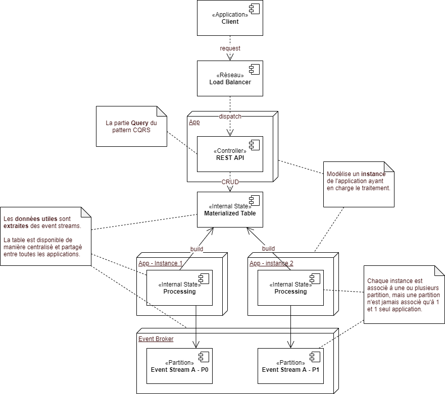

Prenons le cas d'une mise à jour d'une adresse mail, où une application `App`, dédiée à une gestion spécifique, doit modifier une donnée dont elle n'est pas maître, en l'occurrence l'adresse mail (`email`) d'un utilisateur (`User`).

L'entité `User` est géré au sein d'un référentiel de données centralisé de manière à pouvoir concentrer les fonctionnalités associées à la gestion d'un utilisateur, ainsi que de distribuer les informations au travers de l'entreprise (entité transversale).

Le modèle de donnée l'application `App` fait référence au utilisateur et intègre, par conséquent, une partie des attributs de l'entité transversale dans son propre modèle.

Le diagramme ci-dessous montre le processus de mise à jour de l'adresse mail d'un utilisateur, où l'application `App` envoie une commande de mise à jour de l'adresse mail au référentiel de données, qui traite la commande et renvoie un message de confirmation à l'application `App`. Une fois le message de confirmation reçu, l'application `App` met à jour son propre modèle de données avec la nouvelle adresse mail de l'utilisateur lu sur une table matérialisée mise à disposition par l'_event broker_.

> :pencil: **Note** : Il pourrait être tentant de ne pas passer par le référentiel de données pour mettre à jour l'adresse mail de l'utilisateur et de communiquer directement avec l'_event stream_. Néanmoins, il est important de garder à l'esprit que l'_event stream_ n'est pas un _database_ et ne doit pas être utilisé comme tel. En effet, l'_event stream_ est un flux de données qui permet de distribuer des événements entre différentes applications, mais il n'est pas conçu pour implémenter des logiques métiers complexes. Par conséquent, il est préférable de passer par le référentiel, qui contiendra toutes les règles métier pour mettre à jour l'adresse mail de l'utilisateur.

## Étape 1 : La commande

La première étape consiste à envoyer une commande de mise à jour de l'adresse email au référentiel maître de ces données.

Dans ce contexte, `App` connaît l'application maître de la donnée `User` et elle connaît également le contrat de service qui permet de modifier l'email. Il s'agit d'une approche [orienté communication](../1-definition-des-concepts.md#implémentation-orientée-communication-communication-driven), où l'objectif est de faire passer un message d'une application à une autre. Généralement dans ce cas de figure, l'application appelante ne s'attend pas à une réponse immédiate, mais à une réponse asynchrone, une fois que la commande a été traitée. Ici, la commande est envoyée au référentiel de données pour être traitée et attend une confirmation de traitement.

L'envoie de la commande peut être fait en asynchrone via une _queue_, ou via une API REST. Le désavantage de l'API REST est de garder un lien "point à point" entre le référentiel est l'application `App` et par conséquent un couplage fort. Au contraire de l'envoie de la commande via une _queue_, qui permet de déconnecter les deux applications. Attention néanmoins que ce découplage est technique et non fonctionnel, car fonctionnellement, il s'agit bien de modifier la valeur d'un attribut au sein du référentiel. Par conséquent, l'application `App`, reste dépendante du référentiel pour la mise à jour de l'adresse mail.

> :pencil: **Note** : Le couplage fort signifie que, si le référentiel tombe en panne, ne serait-ce que pour une courte durée, l'application `App` ne pourra plus fonctionner. Cela peut être un problème si l'application `App` est critique pour l'entreprise.

### Context Mapping

Dans le diagramme _figure 3 - exemple de mise à jour d'une adresse mail_ on distingue clairement une différence entre le contrat de service de l'application `App` et celui du référentiel de données. En effet, l'application `App` permet de mettre à jour l'adresse email d'un utilisateur grâce au service `updateUserEmail` qui prend en paramètre l'identifiant de l'utilisateur et la nouvelle adresse email. Tandis que le référentiel de données permet de mettre à jour un utilisateur grâce au service `updateUser` qui prend en paramètre un utilisateur.

Le passage d'un périmètre à l'autre s'appel le **Context Mapping** et définit la manière dont les données sont traduites d'un contexte à un autre. L'architecture hexagonale permet de définir une séparation claire entre le domaine de l'application (_domain_)et les dépendances externes (intégrer grâce aux _ports_ et _adapters_).

Le diagramme ci-dessous montre l'adaptateur de sortie qui permet de communiquer avec le référentiel de données pour envoyer la commande de mise à jour de l'adresse mail et qui se charge de faire la conversion entre les deux périmètres fonctionnels et les deux modèle de données.

De cette manière, à aucun moment le domaine de l'application `App` ne devra être adapté à un changement d'architecture d'une dépendance, en l’occurrence ici : le référentiel. Seul l'adaptateur est en charge de l'intégration et va donc être modifié. Néanmoins, il est important de noter que le service de mise à jour de l'utilisateur offert par le référentiel, ne peut en aucun obliger l'application `App` à passer l'ensemble des attributs de l'utilisateur pour une simple mise à jour de l'adresse mail. En effet, dans le cas contraire, l'adaptateur devrait d'abord récupérer l’entièreté des attributs de l'utilisateur, pour ensuite les renvoyer au référentiel avec la nouvelle adresse mail. Ce qui est une perte de performance et de ressource inutile. Une solution serait de découper le service de mise à jour de l'utilisateur en plusieurs services plus fins, qui permettent de mettre à jour un attribut spécifique de l'utilisateur (cf. [Queue](#queue)).

### Queue

Dans l'exemple de la figure 3, l'envoie de la commande de mise à jour de l'adresse mail est fait au travers d'un _queue_ qui permet de mettre à jour un utilisateur "tout entier". Selon les principes DDD, ce type de découpe pose un problème de granularité, car il n'est pas possible d'identifier quelle est la véritable action, au sens métier, qui est réalisée. En effet, la mise à jour de l'adresse mail est une action métier qui doit être identifiée comme telle, or du côté du référentiel, il s'agit d'une mise à jour de l'utilisateur.

Par conséquent, il serait préférable de découper le service de mise à jour de l'utilisateur en plusieurs services plus fins, qui permettent de mettre à jour un attribut spécifique de l'utilisateur. De cette manière, il sera également plus facile de comprendre les actions métiers qui sont réalisées, a fortiori dans un environnement distribué. Le cas échéant, les différentes applications distribuées pourront logger des informations plus précises et par conséquent, l'audit et le débogage seront facilités.

Néanmoins cette approche peut être plus complexe à mettre en place, car dans le pire des cas, une _queue_ est nécessaire pour chaque attribut de l'utilisateur, et l'application cliente devra envoyé autant de message qu'elle modifie d'attribut. Il est donc important de trouver un juste milieu entre la granularité des services et la complexité de l'architecture.

### Erreur de communication

Grâce au mécanisme de _queue_, il est possible de gérer les erreurs de communication entre l'application `App` et le référentiel. En effet, si le référentiel est en panne, l'application `App` peut continuer à envoyer des commandes de mise à jour de l'adresse mail, sans que celles-ci soient perdues. Une fois le référentiel de nouveau disponible, il pourra traiter les commandes en attente.

De même, si le référentiel se trouve dans un état dégradé et qu'il n'est plus en mesure de traiter les commandes, le mécanisme de _queue_ permet de mettre en place un système de _retry_ qui va tenter de renvoyer la commande de mise à jour de l'adresse mail à intervalle régulier.

Le cas échéant, si le référentiel ne peut pas traiter la commande, il est possible de mettre en place un système de _dead letter queue_ qui permet de stocker les commandes qui n'ont pas pu être traitées.

Dans le cas où le référentiel n'a pas pu traiter un message pour des raisons techniques (downtime, coupure réseau, etc.), les messages en _dead letter queue_ pourront être rejoués. Attention toutefois à bien garantir l'ordre et s'assurer que les messages n'ont pas expirés, par exemple si l'adresse mail n'a pas été re-modifié entre-temps.

Dans le cas où le référentiel ne peut pas traiter la commande pour des raisons non techniques, mais inhérente à l'implémentation (donnée incohérente, bug, etc.), une enquête ainsi qu'une opération manuelle, devra être envisagée pour corriger le problème et re-traiter la commande.

En tous les cas, le référentiel doit être capable de gérer les erreurs de communication et de renvoyer un message d'erreur à l'application `App` si la commande de mise à jour de l'adresse mail n'a pas pu être traitée (cf. [Etape 2 : Le traitement](#étape-2--le-traitement)).

### Timeout dans le traitement de la commande

Il se peut que la commande de mise à jour mettent plus de temps à être traitée que prévu. Si le [traitement](#étape-2--le-traitement) tombe en erreur, il est possible que le message tombe en _dead letter queue_ après plusieurs _retry_ et que l'application `App` ne soit notifiée de l'erreur que tardivement. Dans ce cas l'application `App` ne doit pas attendre indéfiniment la réponse du référentiel, mais doit mettre en place un mécanisme de _timeout_. De même, l'application `App` ne doit pas effectuer de _retry_ au risque de renvoyer une commande de mise à jour de l'adresse mail identique à celle qui n'a pas pu être traitée et ce de manière infinie.

> :warning: **Attention** : Ce mécanisme doit également être prévu dans les couches frontend de l'application `App`, par exemple en bloquant l'interface pendant un temps défini.

## Étape 2 : Le traitement

Une fois la commande parvenue au référentiel, par le biais de la _queue_, celui-ci va la traiter et mettre à jour l'adresse mail de l'utilisateur dans l'_event stream_. 

Il s'agit maintenant d'une [communication orientée donnée](../1-definition-des-concepts.md#types-dévénements). En effet l'application va mettre à jour la donnée sans prendre en compte les applications qui en sont dépendantes. Dès lors, un événement sera émis et les applications dépendantes seront notifiées de manière à effectuer les traitements nécessaires, le cas échéant.

Dans l'exemple qui nous concerne, la mise à jour est assez simple et ne demande que très peu de logique métier. Néanmoins, la données doit être validée avant d'être mise à jour, ne serait ce que pour vérifier que l'adresse mail est dans un bon format.

> :pencil: **Note** : La validation du format de la données peut être fait à tout niveau de la chaîne. En effet, un format (date, email, montant, etc.) est généralement le même pour toutes les applications et peut, par conséquent, être implémenté partout de la même manière, souvent par le biais d'un librairie partagée. Néanmoins, même si la validation du format se fait en amont du référentiel, celui-ci à la responsabilité de vérifier la validité des données qui lui sont envoyées, format y compris. Donc, même si le format est vérifié en amont par les "clients", le référentiel va quand même faire une validation de la donnée et renvoyer un résultat de traitement de mise à jour.

### Request-Reply

Dans le cas d'une mise à jour de données, il est souvent nécessaire de renvoyer un résultat à l'application qui a envoyé la commande. Cela permet de garantir que la commande a bien été reçue et traitée. Dans le cas d'une _queue_, il est possible de mettre en place un mécanisme de _request-reply_ qui permet de renvoyer un message de confirmation (_reply_) à l'application `App`.

Néanmoins, il est important de noter que le mécanisme de _request-reply_ peut être complexe à mettre en place, notamment dans un environnement distribué. En effet, il est nécessaire de garantir que le message de confirmation est bien envoyé et reçu par la bonne instance de l'application `App`. De plus, il est nécessaire de gérer les cas d'erreurs, notamment si le message de confirmation n'est pas reçu.

Le diagramme ci-dessous montre le mécanisme de _request-reply_ qui permet de renvoyer un message de confirmation à l'application `App` une fois la commande de mise à jour de l'adresse mail traitée.

Ce qui est important de comprendre c'est que le message de confirmation est envoyé par le référentiel, sur une _queue_ **temporaire**, créé par l'instance qui a envoyé la commande, et uniquement dédiée à cette instance. Autrement dit l'instance qui a envoyé la commande est la seule à pouvoir lire le message de confirmation. En outre, la _queue_ temporaire est supprimée une fois le message de confirmation lu.

> :pencil: **Note** : Il pourrait être envisagé de supprimé la ou les _queue_ temporaire une fois l'instance de l'application `App` déchargée de la mémoire. L'instance de l'application `App` aurait alors un pool de queue temporaire, ou chaque queue serait créée à la demande et supprimée une fois l'instance déchargée de la mémoire.
>
> :pencil: **Note** : Ce type de mécanisme permet de garantir la scalabilité de l'application `App`, car chaque instance de celle-ci va créer sa propre _queue_ temporaire pour recevoir le message de confirmation.
>
> :warning: **Attention** : Il est nécessaire de spécifier l'identifiant de la _queue_ temporaire au référentiel pour qu'il puisse envoyer le message de confirmation sur la bonne _queue_.

### Scalabilité

Le mécanisme de _queue_ permet de mettre en place un système scalable, car il est possible de mettre en place plusieurs instances de l'application `App` qui vont envoyer des commandes de mise à jour de l'adresse mail. Le référentiel va traiter les commandes en parallèle et garantir que les commandes sont traitées dans l'ordre d'arrivée.

> :pencil: **Note** : Dans ce cas, le mécanisme de request-reply expliqué précédemment est toujours valable, car chaque instance de l'application `App` va créer sa propre queue temporaire pour recevoir le message de confirmation (_reply_).

## Étape 3 : Mise à jour de l'application

Une fois le message de confirmation reçu, l'application `App` peut mettre à jour son propre modèle de données. Dans ce cas, il s'agit d'aller lire la nouvelle adresse mail de l'utilisateur sur la table mise à disposition par l'_event broker_.

### Table matérialisée

L'_event broker_ permet de mettre à disposition des données sous forme de table (_materialized table_) qui sont mises à jour en temps réel. Ces tables sont construites à partir d'un ou plusieurs _event streams_ et permettent d'offrir un sous-ensemble de données utiles pour une application spécifique.

Il existe deux moyens pour l'_event broker_ de mettre à disposition des données aux travers de table (_materialized table_) : les tables internes ou les table externes.

#### Table interne

Les tables internes offrent l'énorme avantage de pouvoir être construire en même temps que l'instance de l'application, car elle y sont directement associées, ce qui d'un point de vue de la scalabilité est un avantage. En effet, chaque instance de l'application `App` peut avoir sa propre table interne (_materialized table_) qui est mise à jour en temps réel. Cependant, la mise en route de la table interne peut prendre un certain temps provoquant un délai (_down time_) avant que l'application ne soit pleinement opérationnelle.

Néanmoins, lorsque la totalité des données sont diviser sur plusieurs tables internes (_partition_) et par conséquent sur plusieurs instances, chaque requête doit être routée sur la bonne instance. Ce mécanisme est transparent pour l'application, mais il est nécessaire de le mettre en place et à cet inconvénient d'ajouter une certaine complexité de même qu'un certains coût en termes de performance dû à la nécessité de router les requêtes.

En outre, toujours dans le cas où les données sont partitionnées, cette technique est sensible au mécanisme de re-balancement des partitions. Dans ce cas, les _consumer group_ doivent être mise à jour pour prendre en compte les nouvelles partitions et par conséquent, les modifications de routage.

> :warning: **Attention** : Dans le pire des cas, il peut avoir des problèmes de _race condition_ si les partitions ne sont pas correctement gérées.

> :pencil: **Note** : Le transfert d'une requête entre deux API est possible grâce au information du consumer group qui connaît sa partition et celle des ces voisins. Chaque API doit être capable de router la requête vers la bonne partition grâce à ce mécanisme. Dans les cas les plus lourd, il est possible de mettre en place un système autonome en tête qui va router les requêtes vers la bonne partition.

#### Table externe

Les tables externes offrent l'avantage de pouvoir être construite en dehors de l'instance de l'application, ce qui permet de les partager entre plusieurs applications et de découpler la table de l'instance de l'application. La gestion des tables devient donc plus facile, car il est possible de mettre à jour le _data model_ sans avoir à redémarrer l'instance de l'application. En outre, il n'est plus nécessaire de router les requêtes, car la table externe est accessible par toutes les instances de l'application.

Néanmoins, étant une ressource partagée, elle représente un goulot d'étranglement potentiel et ne peuvent pas être mis à l'échelle de la même manière que les tables internes.

#### Quel type de table choisir ?

En conclusion, le choix entre une table interne et une table externe dépend de la manière dont les données sont utilisées :

- **Table interne** : Si les données sont utilisées uniquement par l'application `App` et qu'elle doit pouvoir être mise à l'échelle rapidement, alors une table interne est préférable. Mais cette option doit être utilisée avec précaution, car elle peut être difficile à mettre en place et à maintenir.

- **Table externe** : Si les données sont partagées entre plusieurs applications et qu'elles doivent être mises à jour fréquemment, alors une table externe est préférable. Mais il faut également s'assurer que la charge sur la table externe ne devienne pas un goulot d'étranglement.

## Gestion des erreurs

:construction: **En construction** : Cette section est en cours de rédaction.

## Débogage et audit

:construction: **En construction** : Cette section est en cours de rédaction.
