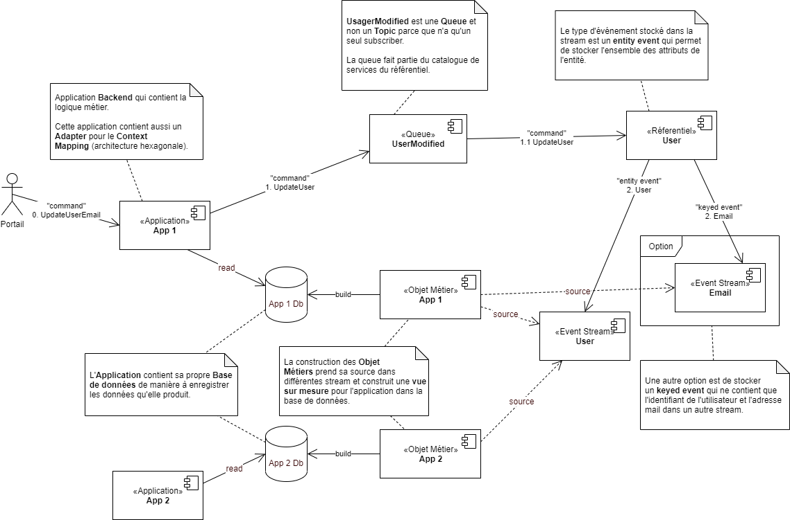
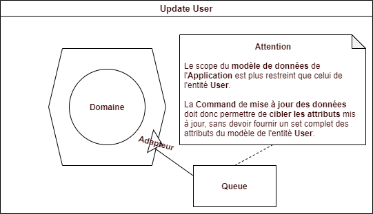
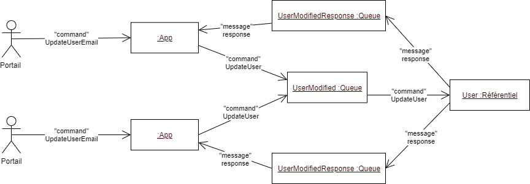
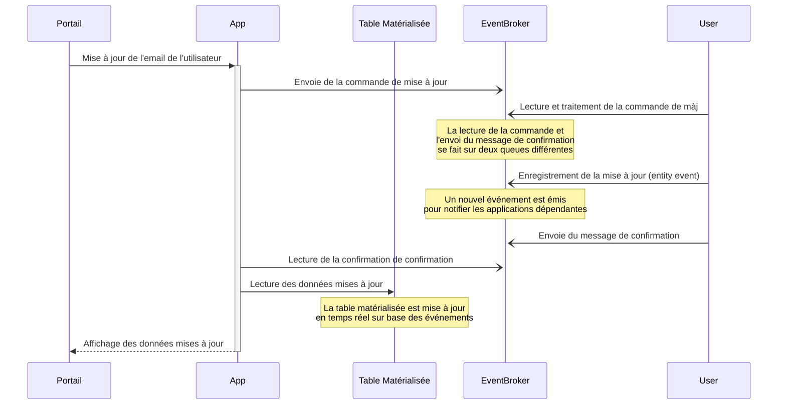
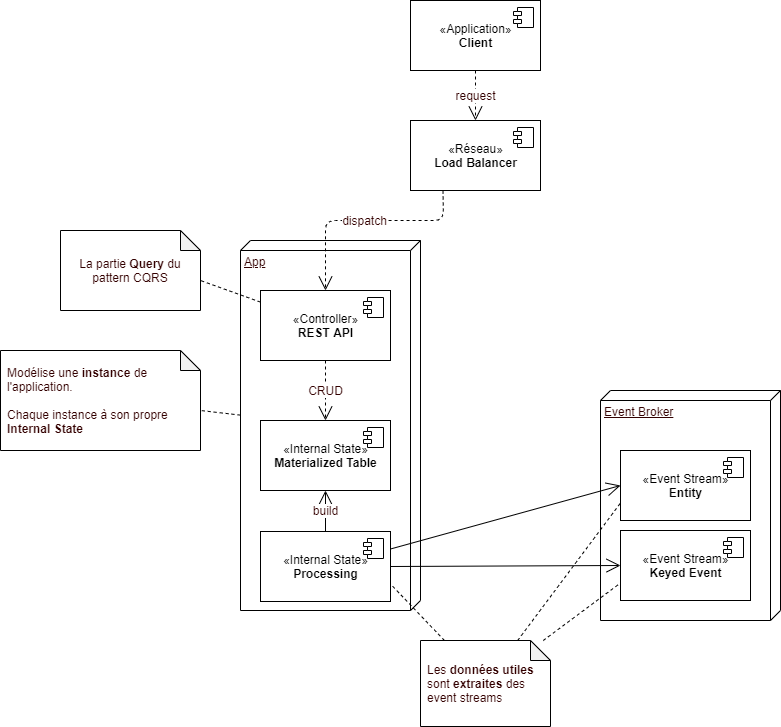
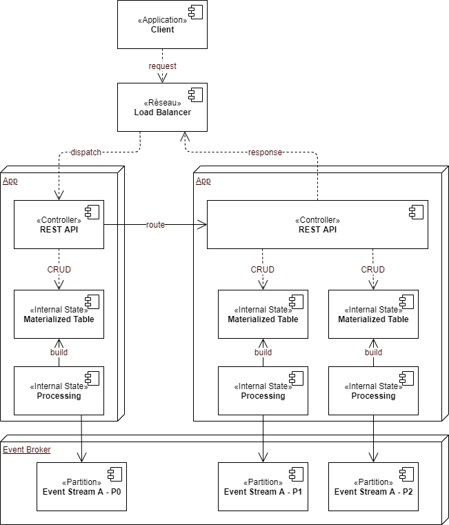
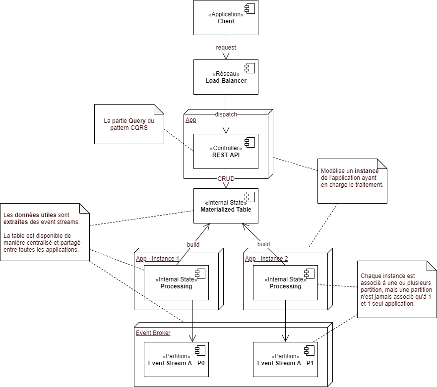
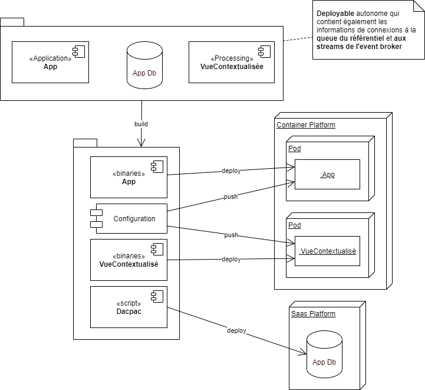

Prenons le cas d'une mise à jour d'une adresse mail, où une application `App`, dédiée à une gestion spécifique, doit modifier une donnée dont elle n'est pas maître, en l'occurrence l'adresse mail (`email`) d'un utilisateur (`User`).

L'entité `User` est géré au sein d'un référentiel de données centralisé de manière à pouvoir concentrer les fonctionnalités associées à la gestion d'un utilisateur, ainsi que de distribuer les informations au travers de l'entreprise (entité transversale).

Le modèle de donnée l'application `App` fait référence aux utilisateurs et intègre, par conséquent, une partie des attributs de l'entité transversale dans son propre modèle.

Le diagramme ci-dessous montre le processus de mise à jour de l'adresse mail d'un utilisateur, où l'application `App` envoie une commande de mise à jour de l'adresse mail au référentiel de données, qui traite la commande et renvoie un message de confirmation à l'application `App`. Une fois le message de confirmation reçu, l'application `App` met à jour son propre modèle de données avec la nouvelle adresse mail de l'utilisateur lu sur une table matérialisée mise à disposition par l'_event broker_.

> :memo: **Note** : Il pourrait être tentant de ne pas passer par le référentiel de données pour mettre à jour l'adresse mail de l'utilisateur et de communiquer directement avec l'_event stream_. Néanmoins, il est important de garder à l'esprit que l'_event stream_ n'est pas un _database_ et ne doit pas être utilisé comme tel. En effet, l'_event stream_ est un flux de données qui permet de distribuer des événements entre différentes applications, mais il n'est pas conçu pour implémenter des logiques métiers complexes. Par conséquent, il est préférable de passer par le référentiel, qui contiendra toutes les règles métier pour mettre à jour l'adresse mail de l'utilisateur.

> :memo: **Note** : Le type d'événement stocké dans la stream `User` est un _entity event_ qui permet de stocker l'ensemble des attributs de l'entité `User` et de garantir que les applications consommatrices disposent de l'ensemble des informations nécessaires pour effectuer les traitements. Néanmoins, il est possible de stocker un _keyed event_ qui ne contient que l'identifiant de l'utilisateur et l'adresse mail dans un autre stream, mais dans ce cas, il est nécessaire d'extraire les informations de plusieurs _event stream_.

## Étape 1 : La commande

La première étape consiste à envoyer une commande de mise à jour de l'adresse email au référentiel maître de ces données.

Dans ce contexte, `App` connaît l'application maître de la donnée `User` et elle connaît également le contrat de service qui permet de modifier l'email. Il s'agit d'une approche [orienté communication](../1-definition-des-concepts.md#implémentation-orientée-communication-communication-driven), où l'objectif est de faire passer un message d'une application à une autre. Généralement dans ce cas de figure, l'application appelante ne s'attend pas à une réponse immédiate, mais à une réponse asynchrone, une fois que la commande a été traitée. Ici, la commande est envoyée au référentiel de données pour être traitée et attend une confirmation de traitement.

L'envoi de la commande peut être fait en asynchrone via une _queue_, ou via une API REST. Le désavantage de l'API REST est de garder un lien "point à point" entre le référentiel est l'application `App` et par conséquent un couplage fort. Au contraire de l'envoi de la commande via une _queue_, qui permet de déconnecter les deux applications. Attention néanmoins que ce découplage est technique et non fonctionnel, car fonctionnellement, il s'agit bien de modifier la valeur d'un attribut au sein du référentiel. Par conséquent, l'application `App`, reste dépendante du référentiel pour la mise à jour de l'adresse mail.

> :memo: **Note** : Le couplage fort signifie que, si le référentiel tombe en panne, ne serait-ce que pour une courte durée, l'application `App` ne pourra plus fonctionner. Cela peut être un problème si l'application `App` est critique pour l'entreprise.
>
> :construction: **En construction** : Ajouter les détails concernant le frontend.

### Context Mapping

Dans le diagramme _figure 3 - exemple de mise à jour d'une adresse mail_ on distingue clairement une différence entre le contrat de service de l'application `App` et celui du référentiel de données. En effet, l'application `App` permets de mettre à jour l'adresse email d'un utilisateur grâce au service `updateUserEmail` qui prend en paramètre l'identifiant de l'utilisateur et la nouvelle adresse email. Tandis que le référentiel de données permet de mettre à jour un utilisateur grâce au service `updateUser` qui prend en paramètre un utilisateur.

Le passage d'un périmètre à l'autre s'appelle le **Context Mapping** et définit la manière dont les données sont traduites d'un contexte à un autre. L'architecture hexagonale permet de définir une séparation claire entre le domaine de l'application (_domain_)et les dépendances externes (intégrer grâce aux _ports_ et _adapters_).

Le diagramme ci-dessous montre l'adaptateur de sortie qui permet de communiquer avec le référentiel de données pour envoyer la commande de mise à jour de l'adresse mail et qui se charge de faire la conversion entre les deux périmètres fonctionnels et les deux modèles de données.

De cette manière, à aucun moment le domaine de l'application `App` ne devra être adapté à un changement d'architecture d'une dépendance, en l’occurrence ici : le référentiel. Seul l'adaptateur est en charge de l'intégration et va donc être modifié. Néanmoins, il est important de noter que le service de mise à jour de l'utilisateur offert par le référentiel, ne peut en aucun obligé l'application `App` à passer l'ensemble des attributs de l'utilisateur pour une simple mise à jour de l'adresse mail. En effet, dans le cas contraire, l'adaptateur devrait d'abord récupérer l’entièreté des attributs de l'utilisateur, pour ensuite les renvoyer au référentiel avec la nouvelle adresse mail. Ce qui est une perte de performance et de ressource inutile. Une solution serait de découper le service de mise à jour de l'utilisateur en plusieurs services plus fins, qui permettent de mettre à jour un attribut spécifique de l'utilisateur (cf. [Queue](#queue)).

### Queue

Dans l'exemple de la figure 3, l'envoi de la commande de mise à jour de l'adresse mail est fait au travers d'un _queue_ qui permet de mettre à jour un utilisateur "tout entier". Selon les principes DDD, ce type de découpe pose un problème de granularité, car il n'est pas possible d'identifier quelle est la véritable action, au sens métier, qui est réalisé. En effet, la mise à jour de l'adresse mail est une action métier qui doit être identifiée comme telle, or du côté du référentiel, il s'agit d'une mise à jour de l'utilisateur.

Par conséquent, il serait préférable de découper le service de mise à jour de l'utilisateur en plusieurs services plus fins, qui permettent de mettre à jour un attribut spécifique de l'utilisateur. De cette manière, il sera également plus facile de comprendre les actions métiers qui sont réalisés, a fortiori dans un environnement distribué. Le cas échéant, les différentes applications distribuées pourront logger des informations plus précises et par conséquent, l'audit et le débogage seront facilités.

> :construction: **En cours de rédaction** : Expliquer comment une _queue_ orienté métier va favoriser le traitement des _events late arrival_.

Néanmoins cette approche peut être plus complexe à mettre en place, car dans le pire des cas, une _queue_ est nécessaire pour chaque attribut de l'utilisateur, et l'application cliente devra envoyer autant de messages qu'elle modifie d'attribut. Il est donc important de trouver un juste milieu entre la granularité des services et la complexité de l'architecture.

### Gestion des erreurs

> :construction: **En cours de rédaction** : Intégrer la gestion des incidents de production lorsqu'un message tombe en DLQ et reprendre les erreurs sur base de ce qui peut arrivé : le traitement de la commande n'est pas possible parce que la data est mauvaise, il y a une erreur métier prévue, il y a une erreur dans le traitement non prévue, la _queue_ n'est plus disponible, le référentiel n'est plus disponible, l'application `App` tombe en timeout.
>
> :construction: **En cours de rédaction** : Des politiques de gestion de _late arrival event_ doivent être mis en place au sein de l'_event broker_ de manière à rejeter les événements périmé. Un événement est considéré périmé, quand un autre du même type est arrivé après lui. Dans ce cas, l'événement périmé doit être rejeté et un log doit être émis pour informer les équipes en charge de l'application. La conception du modèle des événements est primordiale pour cette étape de manière à bien identifier et comparer les mêmes opérations métier (cf. Modèle de données).

#### Erreur de communication

Grâce au mécanisme de _queue_, il est possible de gérer les erreurs de communication entre l'application `App` et le référentiel. En effet, si le référentiel est en panne, l'application `App` peut continuer à envoyer des commandes de mise à jour de l'adresse mail, sans que celles-ci soient perdues. Une fois le référentiel de nouveau disponible, il pourra traiter les commandes en attente.

De même, si le référentiel se trouve dans un état dégradé et qu'il n'est plus en mesure de traiter les commandes, le mécanisme de _queue_ permet de mettre en place un système de _retry_ qui va tenter de renvoyer la commande de mise à jour de l'adresse mail à intervalle régulier.

Le cas échéant, si le référentiel ne peut pas traiter la commande, il est possible de mettre en place un système de _dead letter queue_ qui permet de stocker les commandes qui n'ont pas pu être traitées.

Dans le cas où le référentiel n'a pas pu traiter un message pour des raisons techniques (downtime, coupure réseau, etc.), les messages en _dead letter queue_ pourront être rejoués. Attention toutefois à bien garantir l'ordre et s'assurer que les messages n'ont pas expiré, par exemple si l'adresse mail n'a pas été re-modifié entre-temps.

Dans le cas où le référentiel ne peut pas traiter la commande pour des raisons non techniques, mais inhérentes à l'implémentation (donnée incohérente, bug, etc.), une enquête ainsi qu'une opération manuelle, devra être envisagée pour corriger le problème et re-traiter la commande.

En tous les cas, le référentiel doit être capable de gérer les erreurs de communication et de renvoyer un message d'erreur à l'application `App` si la commande de mise à jour de l'adresse mail n'a pas pu être traitée (cf. [Etape 2 : Le traitement](#étape-2--le-traitement)).

#### Timeout dans le traitement de la commande

Il se peut que la commande de mise à jour mette plus de temps à être traitée que prévu. Si le [traitement](#étape-2--le-traitement) tombe en erreur, il est possible que le message tombe en _dead letter queue_ après plusieurs _retry_ et que l'application `App` ne soit notifiée de l'erreur que tardivement. Dans ce cas l'application `App` ne doit pas attendre indéfiniment la réponse du référentiel, mais doit mettre en place un mécanisme de _timeout_. De même, l'application `App` ne doit pas effectuer de _retry_ au risque de renvoyer une commande de mise à jour de l'adresse mail identique à celle qui n'a pas pu être traitée, et ce de manière infinie.

> :warning: **Attention** : Ce mécanisme doit également être prévu dans les couches frontend de l'application `App`, par exemple en bloquant l'interface pendant un temps défini.

## Étape 2 : Le traitement

Une fois la commande parvenue au référentiel, par le biais de la _queue_, celui-ci va la traiter et mettre à jour l'adresse mail de l'utilisateur dans l'_event stream_.

Il s'agit maintenant d'une [communication orientée donnée](../1-definition-des-concepts.md#types-dévénements). En effet l'application va mettre à jour la donnée sans prendre en compte les applications qui en sont dépendantes. Dès lors, un événement sera émis et les applications dépendantes seront notifiées de manière à effectuer les traitements nécessaires, le cas échéant.

Dans l'exemple qui nous concerne, la mise à jour est assez simple et ne demande que très peu de logique métier. Néanmoins, la donnée doit être validée avant d'être mise à jour, ne serait-ce que pour vérifier que l'adresse mail est dans un bon format.

> :memo: **Note** : La validation du format de la donnée peut être faite à tout niveau de la chaîne. En effet, un format (date, email, montant, etc.) est généralement le même pour toutes les applications et peut, par conséquent, être implémenté partout de la même manière, souvent par le biais d'une librairie partagée. Néanmoins, même si la validation du format se fait en amont du référentiel, celui-ci à la responsabilité de vérifier la validité des données qui lui sont envoyées, format y compris. Donc, même si le format est vérifié en amont par les "clients", le référentiel va quand même faire une validation de la donnée et renvoyer un résultat de traitement de mise à jour.

### Request-Reply

Dans le cas d'une mise à jour de données, il est souvent nécessaire de renvoyer un résultat à l'application qui a envoyé la commande. Cela permet de garantir que la commande a bien été reçue et traitée. Dans le cas d'une _queue_, il est possible de mettre en place un mécanisme de _request-reply_ qui permet de renvoyer un message de confirmation (_reply_) à l'application `App`.

Néanmoins, il est important de noter que le mécanisme de _request-reply_ peut être complexe à mettre en place, notamment dans un environnement distribué. En effet, il est nécessaire de garantir que le message de confirmation est bien envoyé et reçu par la bonne instance de l'application `App`. De plus, il est nécessaire de gérer les cas d'erreurs, notamment si le message de confirmation n'est pas reçu.

Le diagramme ci-dessous montre le mécanisme de _request-reply_ qui permet de renvoyer un message de confirmation à l'application `App` une fois la commande de mise à jour de l'adresse mail traitée.

Ce qui est important de comprendre c'est que le message de confirmation est envoyé par le référentiel, sur une _queue_ **temporaire**, créé par l'instance qui a envoyé la commande, et uniquement dédié à cette instance. Autrement dit l'instance qui a envoyé la commande est la seule à pouvoir lire le message de confirmation. En outre, la _queue_ temporaire est supprimée une fois le message de confirmation lu.

> :memo: **Note** : Il pourrait être envisagé de supprimé la ou les _queue_ temporaire une fois l'instance de l'application `App` déchargée de la mémoire. L'instance de l'application `App` aurait alors un pool de queue temporaire, ou chaque queue serait créée à la demande et supprimée une fois l'instance déchargée de la mémoire.
>
> :memo: **Note** : Ce type de mécanisme permet de garantir la scalabilité de l'application `App`, car chaque instance de celle-ci va créer sa propre _queue_ temporaire pour recevoir le message de confirmation.
>
> :warning: **Attention** : Il est nécessaire de spécifier l'identifiant de la _queue_ temporaire au référentiel pour qu'il puisse envoyer le message de confirmation sur la bonne _queue_.

### Augmentation de la charge

Le mécanisme de _queue_ permet la scalabilité tant pour l'application `App` que pour le référentiel :

- L'application `App` va multiplier ces instances et envoyer ces messages vers la _queue_.
- Le référentiel va multiplier ces instances pour traiter les commandes en parallèle et garantir que les commandes sont traitées dans l'ordre d'arrivée dans un temps raisonnable.

> :memo: **Note** : Dans ce cas, le mécanisme de request-reply expliqué précédemment est toujours valable, car chaque instance de l'application `App` va créer sa propre queue temporaire pour recevoir le message de confirmation (_reply_) et envoyer l'identifiant de la queue.

## Étape 3 : Affichage des données mises à jour

Une fois le traitement terminé et le message de confirmation reçu, l'application `App` peut mettre à jour son propre modèle de données afin de renvoyer l'email mis à jour au portail de manière à être affiché.

```mermaid

sequenceDiagram
    participant Portail
    participant App
    participant Table Matérialisée
    participant EventBroker
    participant User
    Portail->>+App: Mise à jour de l'email de l'utilisateur
    App-)+EventBroker: Envoie de la commande de mise à jour
    User-)EventBroker: Lecture et traitement de la commande de màj
    note over EventBroker: La lecture de la commande et<br/>l'envoi du message de confirmation<br/>se fait sur deux queues différentes
    User-)EventBroker: Enregistrement de la mise à jour (entity event)
    note over EventBroker: Un nouvel événement est émis<br/>pour notifier les applications dépendantes 
    User-)EventBroker: Envoie du message de confirmation
    App-)EventBroker: Lecture de la confirmation de confirmation
    App->>Table Matérialisée: Lecture des données mises à jour
    note over Table Matérialisée: La table matérialisée est mise à jour<br/>en temps réel sur base des événements
    App-->>-Portail: Affichage des données mises à jour
```

:construction: **En cours de rédaction** : Les données sont injectées dans une table au sein de la même base de données que l'application `App`. Cette table est mise à jour en temps réel sur base des événements émis par l'_event broker_. Les données peuvent donc être lues et jointes à d'autres tables pour être affichées sur le portail.

### Table matérialisée

L'_event broker_ permet de mettre à disposition des données sous forme de tables (_materialized table_) qui sont mises à jour en temps réel (sur base des événements). Ces tables sont construites à partir d'un ou plusieurs _event streams_ et permettent d'offrir un sous-ensemble de données utiles pour une application spécifique (_query_).

Il existe deux moyens pour l'_event broker_ de mettre à disposition des données : les tables internes ou les tables externes.

#### Table interne

Les tables internes offrent l'énorme avantage de pouvoir être construire en même temps que l'instance de l'application, car elles y sont directement associées, ce qui d'un point de vue de la scalabilité est un avantage. En effet, chaque instance de l'application `App` peut avoir sa propre table interne mise à jour en temps réel. Cependant, la mise en route de la table interne peut prendre un certain temps provoquant un délai (_downtime_) avant que l'application ne soit pleinement opérationnelle.

Dans un certain cas de figure, lorsque la totalité des données est divisée en plusieurs tables internes (_partition_) et par conséquent sur plusieurs instances, chaque requête doit être routée sur la bonne instance. Ce mécanisme est transparent pour l'application, et permet d'alléger le flux de récupération grâce à la répartition de la charge sur plusieurs instances. Néanmoins, ce mécanisme de routage ajoute une certaine complexité en termes de topologie infra, de même qu'un certain coût en termes de performance dû à la nécessité de router (quasi) toutes les requêtes.

> :memo: **Note** : La chance de tombé sur la bonne instance de l'application `App` est de `1/n` avec `n` le nombre d'instance de l'application `App`. Par conséquent au plus le nombre de d'instance est grand, au plus la chance de tomber sur la bonne partition est faible et dès lors de devoir router la requête vers une autre partition.

En outre, toujours dans le cas où les données sont partitionnées, cette technique est sensible au mécanisme de re-balancement des partitions. Dans ce cas, les _consumer group_ doivent être mises à jour pour prendre en compte les modifications, ce qui peut provoquer un léger _downtime_.

> :warning: **Attention** : Dans le pire des cas, il peut avoir des problèmes de _race condition_ si ce mécanisme n'est pas parfaitement géré.

> :memo: **Note** : Une partition est associée à une (ou plusieurs) clé. Cette information est connue du _consumer group_. Celui-ci permet d'associer une instance à une (ou plusieurs) partition, donc par extension, une instance est associée à une (ou plusieurs) clé. Par conséquent, chaque instance, à l'aide de sa connaissance de l'algorithme de redistribution, connaît sa (ou ses) propre clé, mais également celle(s) de ses voisins. Dès lors chaque instance est en mesure de router une requête sur la bonne instance.
>
> :warning: **Attention** : Une instance peut être associée à plusieurs partitions, mais une partition ne peut être associée qu'à une seule instance. Par conséquent, il n'est pas possible de mettre à l'échelle une instance sur une même partition. Le seul moyen de mettre à l'échelle est de re-partitionner les données. Au maximum, on pourrait avoir autant de partitions qu'il existe de clé, et autant d'instance qu'il existe de partition : 1 clé -> 1 partition -> 1 instance.

#### Table externe

Les tables externes offrent l'avantage de pouvoir être construite en dehors de l'instance de l'application, ce qui permet de les partager entre plusieurs applications et de découpler la table de l'instance de l'application. La gestion des tables devient donc plus facile, car il est possible de mettre à jour le _data model_ sans avoir à redémarrer les instances des applications consommatrices. En outre, il n'est plus nécessaire de router les requêtes, car la table externe est accessible par toutes les instances de l'application.

Néanmoins, étant une ressource partagée, elle représente un goulot d'étranglement potentiel et ne peut pas être mise à l'échelle de la même manière que les tables internes.

#### Quel type de table choisir ?

En conclusion, le choix entre une table interne et une table externe dépend de la manière dont les données sont utilisées :

- **Table interne** : Si les données doivent être mises à disposition dans le cadre d'une utilisation **très** intensive, alors une table interne est préférable. Mais cette option doit être utilisée avec précaution, car elle peut être difficile à mettre en place et à maintenir, surtout s'il existe une instance par partitions, avec un très grand nombre de partitions.

- **Table externe** : Si les données sont partagées entre plusieurs applications et qu'elles doivent être mises à jour fréquemment, alors une table externe est préférable. Mais il faut également s'assurer que la charge sur la table externe ne devienne pas un goulot d'étranglement.

Dans le cas qui nous concerne, la table matérialisée externe est une solution suffisante. D'ailleurs, cette solution sera la plus adéquate dans la plupart des cas.

On peut observer que la différence entre les deux approches se situe surtout au niveau de la découpe, que ce soit en termes d'implémentation ou de gestion de plateforme (Ops) ou encore d'infrastructure. Par conséquent, le passage d'une architecture à l'autre peut se faire relativement facilement, en ce sens qu'il ne demande pas de changement majeur dans le code de l'application, à condition que les principes de bonnes pratiques soient respectés.

## Étude stratégique de l'architecture

L'architecture tant à apporter des solutions aux problèmes de performances, de couplage fort, de scalabilité, de gestion des erreurs et de complexité. Des stratégies sont dès lors mises en place pour garantir le bon fonctionnement de l'ensemble des systèmes.

> :construction: **En cours de rédaction** : Expliquer les notions derrières les différentes notions expliquées ci-dessous.

### Dépendance

Seul le modèle de donnée reste le véritable point de couplage technique et fonctionnel, inévitable, entre les composants. Ce qui présente un avantage face aux architecture qui favorise les couplages point à point via des REST Api. Par conséquent, seules les modifications du modèle de données impactantes (_breaking_) auront des répercutions, mais uniquement avec les systèmes qui l'utilisent.

La _queue_, dans la phase d'envoie de commandes au référentiel, permet d'avoir un découplage entre les composants `App` et `User`, même si d'un point de vue fonctionnel les deux applications reste dépendante l'une de l'autre. Dans ce cas de figure, l'application appelante attend généralement une réponse de l'application appelée avec une statut de l'opération.

L'intégration des dépendances peuvent être gérées au travers de librairie pour garantir une communication avec le _message broker_ et l'_event broker_ de manière uniforme, ceci offrant des fonctionnalités de gestion des erreurs (cf. [Erreurs & pannes](#erreurs--pannes) homogène ou de gestion du scénario [_request-reply_](#request-reply) masquant les difficultés de gestion de queue dynamique.

L'architecture hexagonale permet d'isoler les logique métier de l'application `App`. Par conséquent les composants sont résilients aux changements de l'infrastructure et des dépendances externes.

Les données sont injectées dans une table au sein de la même base de données que l'application `App`. Cette table est mise à jour en temps réel sur base des événements émis par l'_event broker_. Les données peuvent donc être lues et jointes à d'autres tables pour être affichées sur le portail, ce qui représente un très grand avantage en terme de simplicité d'intégration. En outre l'application est complètement autonome et ne dépend pas d'un tiers pour afficher les données.

En conclusion l'architecture permet de garantir un découplage plus fort entre les composants, notamment par la mise ne place de _message broker_, _event broker_ et l'utilisation de pattern de développement tel que l'architecture hexagonale. Par ailleurs, la copy des données directement dans le _data store_ de l'application offre permet une intégration très simple des données sources.

| Critères | |
| --- | --- |
| Découplage fort entre les composants | :heavy_check_mark: |
| Données copiées dans la base de données de l'application | :heavy_check_mark: |

### Erreurs & pannes

Le plus grand avantage de l'architecture est que tous les composants peuvent tomber en panne sans impacter l'ensemble du système :

- Une panne du _message broker_, n'empêche pas l'application `App` de recevoir des données de puis l'_event broker_, mais empêchera l'envoie de commandes au référentiel.
- Une panne de l'_event broker_, n'empêche pas l'application `App` d'envoyer des commandes au référentiel, mais empêchera la mise à jour des données dans la table matérialisée.
- Une panne du référentiel, n'empêche pas l'application `App` de recevoir des données de puis l'_event broker_, mais empêchera le traitement des commandes de mise à jour de l'adresse mail. Ces commandes seront stockées dans la _dead letter queue_.
- Une panne de l'application `App`, n'empêche pas le traitement des commandes de mise à jour de l'adresse mail, mais empêchera l'affichage des données mises à jour sur le portail.

La gestion des messages en erreurs en _dead letter queue_ offre une plus grande résilience face aux erreurs et pannes. Les systèmes sont ainsi plus fiable. Si le référentiel tombe en panne, l'application `App` peut continuer à envoyer des commandes de mise à jour de l'adresse mail, sans que celles-ci soient perdues. Une fois le référentiel de nouveau disponible, il pourra traiter les commandes en attente, soit via une technique de _retry_ automatique du _message broker_, soit après enquête par une équipe en charge des incidents de production. Attention toutefois à bien garantir l'ordre et s'assurer que les messages n'ont pas expiré, par exemple si l'adresse mail n'a pas été re-modifié entre-temps.

Selon l'outil, l'event broker offre des fonctionnalités pour gérer la mise en place des politiques des _late arrival event_. Ces politiques permettent de rejeter les événements périmé et de les loguer pour informer les équipes en charge de l'application. La conception du modèle des événements est primordiale pour cette étape de manière à bien identifier et comparer les mêmes opérations métier (cf. [Modèle de données](#modèle-de-données)).

La combinaison des _dead letter queue_ et des politiques de gestion des _late arrival event_ permet de garantir que les messages ne sont pas perdus et que les événements sont traités dans l'ordre d'arrivée. L'application `App` a la "simple" responsabilité d'afficher les détails de l'incident, en spécifiant à l'utilisateur si son changement a été pris en compte, et le cas échéant sera traité ultérieurement. Une équipe plateforme, ou opérationnelle, doit être en charge de la gestion des incidents de production et doit être en mesure d'accéder à tous les systèmes et toutes les données liées à l'incident, de manière à enquêter sur les causes du problème et le cas échéant lancer une procédure de réparation. Cette procédure de _retry_ manuel permet de pousser les événements de modification sur l'_event broker_.

En conclusion, la gestion des erreurs et des pannes est inhérentes à toute architecture et demande dans tous les cas un investissement en temps et en ressource. L'architecture permet néanmoins de garder le système dans un mode dégradé lorsque une panne survient. Ce mode dégradé garantie qu'une partie du système reste performant, autrement dit, tous les composants peuvent tomber en panne sans impacter l'ensemble du système. L'utilisation d'un _event broker_ permet de gérer le phénomène de _late arrival event_ de manière centrale. Les scénarios d'erreurs peuvent être implémenté dans des librairies qui gèrent la communication avec la _queue_ et qui permettent d'intégrer de manière homogène le traitement à prévoir.

> :memo: **Note** : Dans certains cas, un événement même périmé peut avoir de la valeur et être traité. Par conséquent, la gestion des _late arrival event_ doit être étudiée en fonction du contexte métier.

| Critères | |
| --- | --- |
| Tous les composants peuvent tomber en panne sans impacter l'ensemble du système (mode dégradé) | :heavy_check_mark: |
| Traitement des _late arrival event_ | :heavy_check_mark: |
| Intégration des scénarios d'erreur via des librairies | :white_circle: |

### Performance

L'objectif de l'architecture est de garantir un temps de réponse raisonnable pour l'utilisateur. L'implémentation de communication asynchrone n'implique pas un allongement des temps de réponse d'un point de vue utilisateur. Par conséquent, de manière générale cette architecture reste un statu quo face à une architecture microservices classique.

Les composants sont simples et font de petites choses simples, dès lors les problématiques de performances ne sont pas inclues dans les développements (hormis les bonnes pratiques), mais relayé à la plateforme qui va augmenté ou diminué le nombre d'instance en fonction de la charge (cf. scalabilité). Cette aspect favorise l'industrialisation des développements et permet de se concentrer sur les fonctionnalités métier.

La _queue_ et l'_event broker_ doit être dimensionné pour supporter une grande quantité d'opération, néanmoins cette configuration se fait pour l’entièreté et non composants par composants, ce qui améliore l'industrialisation du suivi des applications. Cependant, ces composants doit être le centre de toutes les attentions, car il est le point de passage d'un grand nombre de données et d'opérations et doit pouvoir répondre dans un temps raisonnable.

Le mécanisme de _request-reply_ demande également une attention particulière, car il crée et supprime des _queues_ de manière dynamique. Cette opération est forcément consommatrice de ressource et doit être géré de manière à ne pas impacter les performances de l'application. Dans ce cadre, il est nécessaire d'avoir une solution ou un outil étudié spécifiquement pour ce cas de figure.

Les données sont injectées dans une table au sein de la même base de données que l'application `App`. Cette table est mise à jour en temps réel sur base des événements émis par l'_event broker_. Les données peuvent donc être lues et jointes à d'autres tables pour être affichées sur le portail, ce qui représente un gain de performance considérable en comparaison à la récupération des données depuis l'API d'une application. Néanmoins, dans le cas où de nombreux événements sont émis, il est possible que la table matérialisée soit littéralement inondée de données, ce qui peut impacter les performances de l'application et éventuellement le serveur de base de données.

Conclusion, l'architecture garantie une réponse à l'utilisateur dans des temps raisonnable, mais demande une attention particulière sur la configuration de la _queue_ et de l'_event broker_ pour garantir des temps de réponse optimaux. Cette architecture présente également des facilités de configuration et de dimensionnement qui permettent de garantir des performances optimales. Par ailleurs, l'utilisation de tables matérialisées permet de garantir des temps de réponses optimaux pour les requêtes SQL, mais demande une attention particulière sur l'insertion des données depuis l'_event broker_.

| Critères | |
| --- | --- |
| Temps de réponse raisonnable | :heavy_check_mark: |
| Une seul base de données permet d'accélérer la lecture des données (jointure entre table, pas d'appel REST API) | :heavy_check_mark: |
| Dimensionnement _event_ et _message broker_ configurable (container, cluster, quota, etc.) prévue pour de très haut débit | :white_circle: |

### Déploiement

En ce qui concerne le déploiement, l'architecture permet de garantir une mise en production continue et autonome des applications. En effet, les applications `App` et `User` sont autonomes et peuvent être déployées indépendamment l'une de l'autre. De plus, l'utilisation de l'_event broker_ permet de garantir que les données sont bien transmises entre les applications, même si elles ne sont pas déployées en même temps.

Seul le modèle de données reste le véritable point de couplage technique et fonctionnel, inévitable, entre les composants et peut donc avoir une influence sur le déploiement. Néanmoins, cette dépendance est inhérente à tout système et ne peut être évitée.

Le déploiement d'environnement à la volée est facilité grâce à l'utilisation de _container_ pour les applications _serverless_ et de _cluster_ pour les _broker_. De même certaines sources peuvent être reconstruites sur base de la lecture des événements contenu dans un _stream_. Ces outils permettent de mettre en place des environnements de test rapidement et de les détruire une fois les tests terminés.

En conclusion, l'architecture permet une planification des déploiement et des rollback de manière autonome et peut également être intégré dans des flux d'intégration continue de même que de déploiement continue, hormis dans le cas de modification impactante du modèle de données échangé sur la _queue_ ou, depuis les _stream_ de l'_event broker_.

| Critères | |
| --- | --- |
| Planification des déploiements et rollback autonome des applications | :heavy_check_mark: |
| Intégration dans un processus automatique (CI/CD) | :heavy_check_mark: |
| Déploiement de composants à la volée (application serverless) | :heavy_check_mark: |
| Reconstruction de données à la volée sur base d'un _stream_ | :heavy_check_mark: |

#### Application `App`

Les packages de l'application `App` et du référentiel `User` sont autonomes et la construction des packages et peut s'intégrer complètement dans un processus automatique (CI). Par conséquent la planification de déploiement et de rollback peut se faire également de manière autonome, hormis dans le cas de modification impactante du modèle de données échangé sur la _queue_ ou, depuis les _stream_ de l'_event broker_.

> :memo: **Note** : Si le modèle de données de l'application `App` change et qu'il intègre de nouveaux attributs ou en supprime, il est nécessaire de mettre à jour le composant qui extrait les données de l'_event stream_ pour les injecter dans la base de données de l'application `App`. Néanmoins, ce composant faisant partie du package de déploiement de l'application `App`, il est possible de le mettre à jour en même temps que l'application. Le déploiement reste donc autonome et ne nécessite pas de coordination avec d'autres équipes.

#### Référentiel `User`

> :construction: **En cours de rédaction** : Appréhender l'idée de création d'une queue lors du déploiement et de la mise à jours de la configuration du référentiel lors de l'exécution de la pipeline de CD.

### Scalabilité

L'application `App` et le référentiel `User` sont des application _serverless_ et peuvent donc être mise à l'échelle à souhait ou de manière automatique sur base de politique configuré sur la plateforme de containérisation. Ceci permet notamment de reléguer les préoccupations de performances à la plateforme et de garantir une scalabilité des applications sans impacter les développements (hormis les bonnes pratiques de bases).

Dans le cas, où il est nécessaire de traiter un grand nombre de données, l'_event broker_ est en mesure d'organiser les données dans plusieurs partition de manière à ce que chacune d'entre elles soient traitées par une instance du référentiel `User`.

En conclusion, la scalabilité offre l'avantage d'offrir des solutions aux problèmes de performances sans pour autant impacter les développements et permet donc d'augmenter la productivité des équipes.

| Critères | |
| --- | --- |
| Application _serverless_ hautement scalable  | :heavy_check_mark: |
| Préoccupation des problèmes de performances délégué à la plateforme, plutôt qu'au développement | :heavy_check_mark: |
| Partitionnement des données sur l'_event broker_ | :heavy_check_mark: |

### Haute disponibilité

Le plus gros impacte en terme de haute disponibilité est sur l'_event broker_ et le _message broker_ qui doit être disponible en permanence pour garantir la communication entre les applications. Néanmoins, la mise en place de _cluster_ et de _replica_ permet de garantir une haute disponibilité de l'_event broker_. De même que le _message broker_ qui doit être disponible en permanence pour garantir la communication entre les applications. Les autres applications peuvent tomber en panne sans impacter le fonctionnement de l'ensemble du système permettant à celui-ci de fonctionner dans un mode dégradé.

En conclusion, seul l'_event broker_ et le _message broker_ doivent être disponibles en permanence pour garantir le bon fonctionnement de l'ensemble du système. Cette architecture diminue donc la complexité de la mise en place de la haute disponibilité face à une architecture microservices classique qui impose une haute disponibilité de l'ensemble des applications.

| Critères | |
| --- | --- |
| _Event broker_ et _message broker_ doivent avoir le plus haut degré de disponibilité | :x: |
| Le nombre de composants demandant une haute disponibilité est réduit | :heavy_check_mark: |

### Modèles de données

L'application `App` possède sa propre base de données pour stocker le résultat de ces propres calculs. Cette base de données est mise à jour en temps réel sur base des événements émis par l'_event broker_. Les données de l'utilisateur (`User`) et d'autres données sont injectées dans cette base de données grâce à un composant qui va extraire, sur base de _queries_, les données contenues dans les _event stream_. L'application `App` peut donc fonctionner de manière autonome sur base de son propre modèle de données, sans devoir accéder à des applications tiers pour lire des données. De cette manière, l'application définie de manière complètement autonome les données dont elle a besoin pour fonctionner. Ce principe permet notamment de limiter le nombre d'information sur base de l'usage de l'application et permet également une prise en main plus rapide de l'application par un développeur.

L'_event broker_ est un _data store_ qui va conserver tous les évènements et leurs historiques à vie. Dans certains cas, les applications auront besoin de pouvoir parcourir l'historique, par exemple, dans notre cas, l'affichage de l'historique des modifications des emails avec l'utilisateur authentifié associé à cette modification.

Sur base des principes du _domaine-driven-design_ (DDD), les contrats de services sont découpés de manière à correspondre le plus possible aux opérations métiers. De cette manière, la traçabilité des opérations au travers des différents composants est facilité (audit, monitoring et diagnostique). En outre, ce type de découpe, permet une gestion plus fine des _late arrival event_ (cf. [Erreurs & pannes](#erreurs--pannes)). Par conséquent, cette architecture permet une bonne intégration des principes de DDD et permet de garantir une cohérence des données entre les différents composants.

En conclusion, cette architecture offre des avantages de gestion de modèle de données où chaque application possède son propre modèle de données et peut fonctionner de manière autonome. Le scope réduit des données permet de garantir une meilleure prise en main

| Critères | |
| --- | --- |
| Chaque application possède son propre modèle de données (scope réduit) | :heavy_check_mark: |
| Les contrats de services sont découpés de manière à correspondre le plus possible aux opérations métiers (respect des principes DDD) | :heavy_check_mark: |
| Les modèles de données peuvent être reconstruits à la volée sur base des événements | :heavy_check_mark: |

### Sécurité

Dans cette architectures :

- Les informations de l'utilisateur authentifié sont transportées de composants en composants de manière à pouvoir appliquer les règles d'autorisations (RBAC).
- Les données injectées en base de données depuis les _event streams_ doivent être protégée contre l'écriture. Néanmoins, il s'agit d'un protection lié à l'implémentation. Par conséquent, une erreur d'implémentation peut mettre en péril ce principe.
- Les données injectées en base de données depuis les _event streams_ doivent être limitée à un périmètre fonctionnel et ne pas contenir d'information sensible hors du périmètre fonctionnel.

En conclusion, l'architecture permet de garantir une sécurité des données en limitant l'accès aux données à un périmètre fonctionnel et en garantissant que les données sont protégées contre l'écriture. Les données sont transportées de manière sécurisée entre les composants et les règles d'autorisations sont appliquées à chaque étape de la chaîne.

| Critères | |
| --- | --- |
| Les données sont transportées de manière sécurisée entre les composants | :heavy_check_mark: |
| Les données injectées en base de données depuis les _event streams_ sont protégées contre l'écriture | :heavy_check_mark: et :x: |
| Les données injectées en base de données depuis les _event streams_ sont limitées à un périmètre fonctionnel | :heavy_check_mark: |

### Maintenance et évolution

L'upgrade de l'_event broker_ aura le plus d'impacte, car il est l'élément central de l'architecture. Ceci dit, tant que les modifications sont rétro-compatible, les applications n'auront pas besoin d'être modifiées.

Toute modifications du modèle de données échangé sur la _queue_ ou depuis les _stream_ de l'_event broker_ aura des impactes sur les applications qui les consomment. Néanmoins, ces modifications peuvent être gérées de manière à minimiser l'impacte sur les applications, notamment en mettant en place des architectures hexagonales, des librairies de communication, etc.

Le scope limité des données dans l'application `App` permet de réduire la surface de dépendance et de garantir une maintenance plus aisée des applications.

Conclusion, l'impacte de la maintenance des outils de _message broker_ et d'_event broker_ ont un impacte important, mais ce type d'impact est présent dans toute architecture. L'évolution des applications est facilitée grâce à la diminution au maximum des surfaces de dépendances grâce au découplage et au modèle de données limité.

| Critères | |
| --- | --- |
| Les modifications du modèle de données échangé depuis les _stream_ de l'_event broker_ ont des impactes limités étant données qu'il s'agit d'un sous-ensemble | :heavy_check_mark: |
| Possibilité d'avoir des étapes intermédiaires pour gérer les modifications du modèle de données échangé depuis les _stream_ de l'_event broker_ | :heavy_check_mark: |
| L'upgrade de l'_event broker_ et du _message broker_ a le plus d'impacte | :x: |
| Vendor lock-in | :x: |

### Décommissionnement

Le décommissionnement des applications est simplifié, car la production des données est découplée de la consommation. Par conséquent, même si l'application disparaît, les données partagées sont toujours disponibles pour les autres applications et ne casse pas le flux.

Il est également envisageable de mettre en route des processus de libération de la données pour exporter les données d'une base de données (stand alone) vers le _data store_ de l'_event broker_.

Conclusion, cette architecture offre un réel avantage quant au processus de décommissionnement des applications, car les données restent disponibles pour les autres applications et ne casse pas le flux.

| Critères | |
| --- | --- |
| Les données restent disponibles pour les autres applications même si l'application disparaît | :heavy_check_mark: |

### Capacity Planning

Le modèle de conception, mais également le modèle de données permet de limiter les responsabilités et les fonctionnalités par composants de manière à gagner en flexibilité. La charge de travail et par conséquent redistribuée entre plusieurs équipes, ce qui permet à chacune d'entre-elle de se concentrer sur son propre domaine d'expertise, qu'il soit technique ou fonctionnel, et augmente la vitesse de prise en main. Néanmoins, un effet de bord de cette pratique peut mener à un effet de silo, ou d'équipes sous-optimisées en terme de taille. Par ailleurs, la gestion d'un _event broker_ demande une expertise particulière et une équipe dédiée.

Conclusion, les équipes peuvent être plus vite formées et plus rapidement opérationnelles, mais il est nécessaire d'avoir une excellente collaboration entre les équipes, de même que des équipes correctement dimensionnées. Par ailleurs, les équipes opérationnelles auront plus de maîtrises sur les composants et seront plus à même de gérer la charges, les déploiements et les incidents de production. Néanmoins, la découpe implique une nouvelle organisation des équipes (change management) et de nouvelles compétences spécifiques doivent être acquises pour gérer l'_event broker_.

| Critères | |
| --- | --- |
| Scope des composants limités, donc les équipes peuvent être plus vite formées et plus rapidement opérationnelles | :heavy_check_mark: |
| Les équipes opérationnelles ont plus de maîtrises sur les composants et sont plus à même de gérer la charges, les déploiements et les incidents de production | :heavy_check_mark: |
| Gestion de l'_event broker_ demande une expertise particulière et une équipe dédiée | :x: |

### Testabilité et qualité

Les tests end-to-end demandent une intégration avec le référentiel `User` disponible en environnement de développement et de tests. Ceci implique que la _queue_ utilisé pour les tests soit connue du référentiel et que les données soient bien envoyées sur la _queue_ de test.

| Type de tests | Application `App` | Référentiel `User` | _Queue_ `UserModified` | Base de données `App` | `VueContextualisé` | `EventBroker` |
|---------------|-------------------|--------------------|------------------------|----------------------|---------------------|---------------|
| Unitaire | Exécuté en local de la machine et lors du CI | N/A | L'intégration de la _queue_ doit être mocké | En local ou distante | N/A | N/A |
| Intégration | Exécuté en local de la machine ou déployé un environnement dédié | Déployé sur un environnement de test | Intégration de la _queue_ afin de garantir la validité du schéma de donnée | De préférence distante car éprouvé par l'équipe | Instance de test qui va lire les données des _streams_ impacté par la commande, de manière à vérifier la cohérence. | _Event Broker_ de tests impacté par la commande envoyé par l'application.  |

Les tests end-to-end sont exécuté dans un environnement le plus stable et le plus proche de la réalité possible.

### Traçabilité

En partant du postulat que les événements sont bien identifiés et que les opérations métier sont bien définies, la traçabilité des opérations est garantie. En effet, chaque événement est associé à une opération métier et à un utilisateur, ce qui permet de retracer l'ensemble des opérations effectuées par un utilisateur. De plus, les événements sont stockés dans l'_event broker_ et peuvent être consultés à tout moment pour retracer l'historique des opérations.

L'outil de monitoring dans ce cadre à une grande importance et doit pouvoir être intégré à tous les niveaux de l'architecture. Il doit permettre de suivre l'ensemble des événements, de manière à pouvoir identifier les problèmes et les corriger rapidement.

En conclusion, la traçabilité des opérations est garantie par la définition des événements et des opérations métier. Les événements sont stockés dans l'_event broker_ et peuvent être consultés à tout moment pour retracer l'historique des opérations. L'outil de monitoring doit permettre de suivre l'ensemble des événements, de manière à pouvoir identifier les problèmes et les corriger rapidement.

| Critères | |
| --- | --- |
| Les événements sont associés à une opération métier et à un utilisateur | :heavy_check_mark: |
| Les événements sont stockés dans l'_event broker_ et peuvent être consultés à tout moment pour retracer l'historique des opérations | :heavy_check_mark: |
| L'outil de monitoring permet de suivre l'ensemble des événements, de manière à pouvoir identifier les problèmes et les corriger rapidement | :heavy_check_mark: |

### Coût

La complexité des fonctionnalités inhérentes à la mise en place d'une architecture amène de nouveaux problèmes plus complexes, notamment dû à la notion de message asynchrones, de processus de production et consommation de la données découplé, de gestion d'événements, d'erreur et de panne. Ces problèmes demandent une expertise plus poussée et une monté en compétence des équipes quelque soit l'architecture (avec ou sans _event stream_). Sur ce point donc, tout changement d'architecture demande un investissement en temps et en ressource qui aura un impacte sur le coût de développement.

Plus spécifiquement, une architecture orienté événement avec _event broker_ demande un investissement spécifique pour la mise en place et la maintenance de l'_event broker_. Ce coût est un balance entre l'acquisition d'un outil et les compétences à acquérir liées à celui-ci, et le bénéfice apporté par les fonctionnalités de l'outil en comparaison de devoir les développer soi-même.

En conclusion, tout migration vers une architecture orienté événement implique un coût d'investissement, notamment en terme de monté en compétence des équipes et d'acquisition d'outils spécifiques. Néanmoins, cette architecture offre des avantages en terme de scalabilité, de maintenance et de qualité qui peuvent justifier cet investissement. En outre, le choix de certains outils peut permettre de réduire le coût de développement et de maintenance.

| Critères | |
| --- | --- |
| Coût de développement et de maintenance réduit grâce à l'utilisation d'outils spécifiques | :heavy_check_mark: |
| Investissement en temps et en ressource pour la monté en compétence des équipes et l'acquisition d'outils spécifiques | :white_circle: |
| Coût d'acquisition d'un outil spécifique et de formation pour la mise en place et la maintenance de l'_event broker_ | :x: |

### En résumé

L'architecture orienté événement avec event stream offre une grande flexibilité à bien des niveaux, mais demande une expertise plus poussée notamment concernant la gestion de l'event broker et est sensiblement plus complexe à mettre en place dû aux composants supplémentaires.

Néanmoins des solutions permettent de garantir une scalabilité et une maintenance plus aisée des applications et par conséquent une meilleure qualité de service, pour un coût de développement moindre.

#### Avantages

Les développements sont plus rapide, car beaucoup plus orienté fonctionnel :

- La queue et l'event broker présente l'avantage d'intégrer des fonctionnalités built-in tel que le _retry_ automatique, _dead letter queue_, _request-reply_, _late arrival event_, etc.
- La scalabilité est une responsabilité plateforme : plus besoin de gérer le nombre de threads, de connexions, etc.
- Les intégrations sont prises en charge par des librairies.
- Les modèles de données sont simples, orienté métier et associé à périmètre fonctionnel.
- L'architecture favorise le découplage des composants, mais également à l'intérieur des composants avec l'architecture hexagonale, les composants `Processing` qui construisent les tables matérialisées, etc.

La gestion des composant est simplifié :

- Un event broker à dimensionné pour toute l'entreprise.
- Des politiques de scalabilité, de quota par type d'application.
- Architecture serverless pour les applications `App` et `User`.
- Scalabilité automatique basée sur la plateforme de conteneurisation.

La gestion des données est simplifié :

- Politique de gestion des données centralisée.
- Gestion des étapes de flux dans un outil unique (change data capture, transformation et création de table matérialisée).
- Intégration des données dans les outils de storage : base de données relationnelle, index, no-sql, built-in.

#### Inconvénients

- Vendor lock-in avec l'event broker pour toute l'entreprise car _single source of truth_ et _single version of truth_.
- Nouvelles compétences et nouvelle équipe spécifique à acquérir pour la gestion de l'event broker.
- _Data libération_ (migration des données) vers le _data store_ de l'event broker des données partagées.
- Single point of failure avec l'_event broker_ et du _message broker_, bien que les applications peuvent fonctionner de manière dégradée :
  - Si l'_event broker_ tombe en panne, les applications ne peuvent plus recevoir les données mises à jour.
  - Si le _message broker_ tombe en panne, les applications ne peuvent plus envoyer de commandes de modification (création, mise à jour ou suppression).
