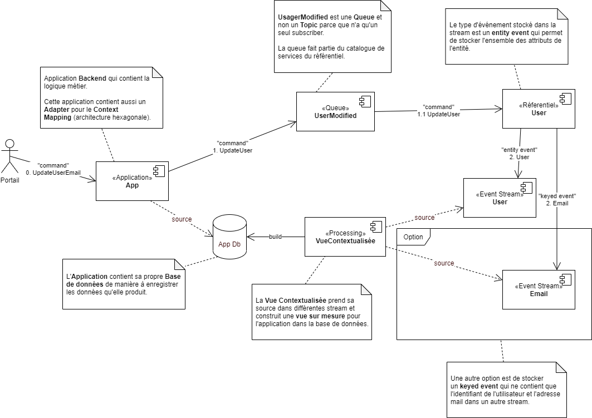

Prenons le cas d'une mise à jour d'une adresse mail, où une application `App`, dédiée à une gestion spécifique, doit modifier une donnée dont elle n'est pas maître, en l'occurrence l'adresse mail (`email`) d'un utilisateur (`User`).

L'entité `User` est géré au sein d'un référentiel de données centralisé de manière à pouvoir distribuer les informations au travers de l'entreprise (entité transversale). Néanmoins, l'application `App` à également son propre modèle de données qui est, notamment un sous-ensemble des données de l'entité `User`.

## Étape 1 : La commande

La première étape consiste à envoyer une commande de mise à jour de l'adresse mail au référentiel maître de ces données.

Dans ce contexte, `App` connaît l'application maître de la donnée `User` et elle connaît également le contrat de service qui permet de modifier. Il s'agit d'une approche [orienté communication](../1-definition-des-concepts.md#implémentation-orientée-communication-communication-driven), où l'objectif est de faire passer un message d'une application à une autre.

L'envoie de la commande peut être fait en asynchrone via une _queue_, ou via une API REST. Le désavantage de l'API REST est de garder un lien "point à point" entre le référentiel est l'application `App` et par conséquent un couplage fort, au contraire de l'envoie de la commande via une _queue_ qui permet de déconnecter les deux applications. Attention néanmoins que ce découplage est technique et non fonctionnel, car fonctionnellement, il s'agit bien de modifier la valeur d'un attribut au sein du référentiel. Par conséquent, l'application `App`, reste dépendante du référentiel pour la mise à jour de l'adresse mail.

> :pencil: **Note** : Le couplage fort signifie que, si le référentiel tombe en panne, ne serait-ce que pour une courte durée, l'application `App` ne pourra plus fonctionner. Cela peut être un problème si l'application `App` est critique pour l'entreprise.

### Context Mapping

Dans le diagramme _figure 3 - exemple de mise à jour d'une adresse mail_ on distingue clairement une différence entre le contrat de service de l'application `App` et le référentiel de données. En effet, l'application `App` permet de mettre à jour l'adresse mail d'un utilisateur grâce au service `updateUserEmail` qui prend en paramètre l'identifiant de l'utilisateur et la nouvelle adresse mail, tandis que le référentiel de données permet de mettre à jour un utilisateur grâce au service `updateUser` qui prend en paramètre un utilisateur.

Le passage d'un périmètre à l'autre s'appel le **Context Mapping** et définit la manière dont les données sont traduites d'un contexte à un autre. L'architecture hexagonale permet de définir une séparation claire entre le domaine de l'application (_domain_)et les dépendances externes (_port_ et _adapter_).

Le diagramme ci-dessous montre l'adaptateur de sortie (_output adapter_) qui permet de communiquer avec le référentiel de données pour envoyer la commande de mise à jour de l'adresse mail et qui se charge de faire la conversion entre les deux périmètres fonctionnels.

De cette manière, à aucun moment le domaine de l'application `App` ne devra être adapté à un changement d'architecture d'une dépendance, en l’occurrence le référentiel. Seul l'adaptateur de sortie est en charge d'adapter l'intégration. Néanmoins, il est important de noter que le service de mise à jour de l'utilisateur offert par le référentiel, ne peut en aucun obliger l'application `App` à passer l'ensemble des attributs de l'utilisateur pour une simple mise à jour de l'adresse mail.

### Queue

Dans l'exemple de la figure 3, l'envoie de la commande de mise à jour de l'adresse mail est fait au travers d'un _queue_ qui permet de mettre à jour un utilisateur "tout entier". Selon les principes DDD, ce type de découpe pose un problème de granularité, car il n'est pas possible d'identifier quelle est la véritable action, au sens métier, qui est réalisée. En effet, la mise à jour de l'adresse mail est une action métier qui doit être identifiée comme telle, or du côté du référentiel, il s'agit d'une mise à jour de l'utilisateur.

Par conséquent, il serait préférable de découper le service de mise à jour de l'utilisateur en plusieurs services plus fins, qui permettent de mettre à jour un attribut spécifique de l'utilisateur. De cette manière, il sera également plus facile de comprendre les actions métiers qui sont réalisées, a fortiori dans un environnement distribué. Le cas échéant, les différentes applications distribuées pourront logger des informations plus précises et par conséquent, l'audit et le débogage seront facilités.

Néanmoins cette approche peut être plus complexe à mettre en place, car elle nécessite potentiellement de mettre place des _queues_ pour chaque attribut de l'utilisateur. Il est donc important de trouver un juste milieu entre la granularité des services et la complexité de l'architecture.

### Erreur de communication

Grâce au mécanisme de _queue_, il est possible de gérer les erreurs de communication entre l'application `App` et le référentiel. En effet, si le référentiel est en panne, l'application `App` peut continuer à envoyer des commandes de mise à jour de l'adresse mail, sans que celles-ci soient perdues. Une fois le référentiel de nouveau disponible, il pourra traiter les commandes en attente.

De même, si le référentiel se trouve dans un état dégradé et qu'il n'est plus en mesure de traiter les commandes, le mécanisme de _queue_ permet de mettre en place un système de _retry_ qui va tenter de renvoyer la commande de mise à jour de l'adresse mail à intervalle régulier. Le cas échéant, si le référentiel ne peut pas traiter la commande, il est possible de mettre en place un système de _dead letter queue_ qui permet de stocker les commandes qui n'ont pas pu être traitées et d'attendre que le référentiel soit de nouveau disponible.

## Étape 2 : Le traitement

Une fois la commande parvenue au référentiel, par le biais de la _queue_, celui-ci va traiter la commande et mettre à jour l'adresse mail de l'utilisateur. Dans ce cas, la mise à jour est assez simple et ne demande que très peu de logique métier. Néanmoins, la données doit être validée avant d'être mise à jour, ne serait ce que pour vérifier que l'adresse mail est bien au bon format.

> :pencil: **Note** : La validation du format de la données peut être fait à tout niveau de la chaîne. En effet, un format (par exemple d'email) et généralement le même pour toutes les applications et peut, par conséquent, être implémenté partout de la même manière, souvent par le biais d'un librairie partagée. Néanmoins, même si la validation du format se fait en amont du référentiel, celui-ci à la responsabilité de vérifier la validité des données qui lui sont envoyées, format y compris. Donc, même si le format est vérifié en amont par les "clients", le référentiel va quand même faire une validation de la donnée et renvoyer un résultat.

### Request-Reply

Dans le cas d'une mise à jour de données, il est souvent nécessaire de renvoyer un résultat à l'application qui a envoyé la commande. Cela permet de garantir que la commande a bien été reçue et traitée. Dans le cas d'une _queue_, il est possible de mettre en place un mécanisme de _request-reply_ qui permet de renvoyer un message de confirmation (_reply_) à l'application `App`.

Néanmoins, il est important de noter que le mécanisme de _request-reply_ peut être complexe à mettre en place, notamment dans un environnement distribué. En effet, il est nécessaire de garantir que le message de confirmation est bien envoyé et reçu par la bonne instance de l'application `App`. De plus, il est nécessaire de gérer les cas d'erreurs, notamment si le message de confirmation n'est pas reçu.

Le diagramme ci-dessous montre le mécanisme de _request-reply_ qui permet de renvoyer un message de confirmation à l'application `App` une fois la commande de mise à jour de l'adresse mail traitée. Ce qui est important de comprendre c'est que le message de confirmation est envoyé par le référentiel sur une _queue_ **temporaire** créé par l'instance qui a envoyé la commande et uniquement dédiée à cette instance, autrement dit l'instance qui a envoyé la commande est la seule à pouvoir lire le message de confirmation. En outre, la queue temporaire est supprimée une fois le message de confirmation lu. Par conséquent, lors du retour du message de confirmation , il est nécessaire de spécifier l'identifiant de la queue temporaire pour que le référentiel puisse envoyer le message de confirmation.

> :pencil: **Note** : Ce type de mécanisme permet de garantir la scalabilité de l'application `App`, car chaque instance de celle-ci va créer sa propre _queue_ temporaire pour recevoir le message de confirmation.

### Scalabilité

Le mécanisme de _queue_ permet de mettre en place un système scalable, car il est possible de mettre en place plusieurs instances de l'application `App` qui vont envoyer des commandes de mise à jour de l'adresse mail. Le référentiel va traiter les commandes en parallèle et garantir que les commandes sont traitées dans l'ordre d'arrivée.

> :pencil: **Note** : Dans ce cas, le mécanisme de request-reply expliqué précédemment est toujours valable, car chaque instance de l'application `App` va créer sa propre queue temporaire pour recevoir le message de confirmation (_reply_).

## Etape 3 : Rafraîchissement de l'affichage

## Gestion des erreurs

:construction: **En construction** : Cette section est en cours de rédaction.

## Débogage et audit

:construction: **En construction** : Cette section est en cours de rédaction.