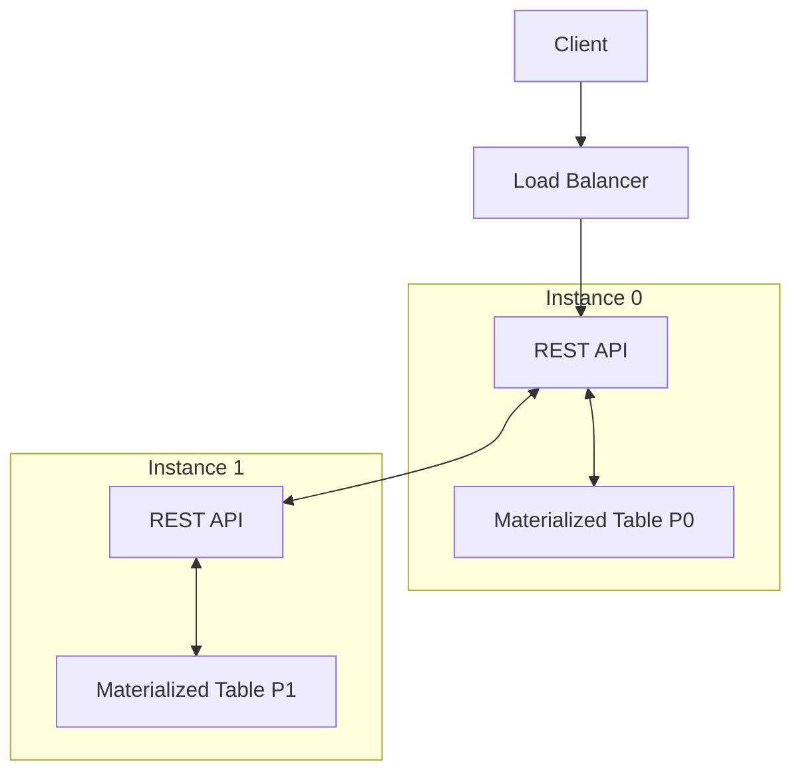

# Integrating Event-Driven and Request-Response Microservices

Aussi pratique peut être une architecture événementielle, certains aspects sont moins bien adaptés à ce type d'architecture, notamment dans les requêtes de type GET : 

- Les requêtes de collection depuis les sources extérieurs (APIs, bases de données, etc.) sont plus difficiles à gérer.
- L'intégration avec un système de type _request-response_ est plus complexe.
- La diffusion de contenu en temps réel sur des applications web ou mobile.
- La diffusion de requêtes dynamiques sur base d'informations en temps réel.

## Handling External Events

Une _event streams_ n'est jamais exposé directement à l'extérieur, notamment pour des raisons de droits et sécurité. Pour intégrer des événements externes, le traditionnel _request-response_ est une bonne solution.

### Autonomously Generated Events

Typiquement les évènements analytiques dû à des actions de l'utilisateur (click, etc.) qui sont générés par le système lui-même : mesure périodique, IoT, etc. ils décrient l'état du système ou d'un processus avec des métriques.

### Reactively Generated Events

Dans ce cas, l'évènement n'est pas associé à la requête, mais à la réponse.

## Handling Autonomously Generated Events

Les évènements, éventuellement de type différents, peuvent être agrégés dans une requête et sont envoyés à une API d'où ils seront routés vers une _event stream_. Les schémas des évènements sont essentiels de manière à ce qu'il n'y ait pas d'ambiguïté possible lors du routage. En effet, une application mobile V1 peut envoyer des données différentes de la V2, installé sur un autre appareil.

## Integrating with Third-Party Request-Response APIs

Il est tout à fait possible d'intégrer des appels à des APIs externes dans une architecture événementielle, simplement en envoyant une requête à l'API durant le traitement d'un événement et en attendant la réponse. La requête peut se faire de manière asynchrone, de sorte à ne pas bloquer le traitement de l'événement.

Il existe toutefois des désavantages à cette approche, notamment sur le fait que le traitement de l'API est non-déterministe. En outre, si la maintenance de l'API est géré par un tiers, il est possible que des changements de l'API impactent le système. Finalement, il n'est pas rare que lors d'une erreur une grande quantité d'événements soient rejouer lors d'un traitement correctif. Dans ce cas, l'API sera surchargée d'appels provoquant ainsi des erreurs ou un blocage (IP banni, etc.). Pour éviter cela, il est possible d'introduire des comportement de _rate limiting_ ou de _quota_.

## Processing and Serving Stateful Data

Il est également possible de créer des microservices événementiels qui fournissent un endpoint de type _request-response_. Le microservice va consommer un événement, le traiter et stoker le résultat. L'API de type _request-response_ va alors interroger un _state store_ pour obtenir les données. Il existe deux approches pour ce type de microservice : fournir les résultats via un _state store_ interne ou externe.

### Serving Real-Time Requests with Internal State Stores

Le microservice va mettre à disposition un endpoint de type _request-response_ qui va interroger un _state store_ interne. Le _state store_ est mis à jour à chaque événement reçu.

Dans le cas où il existe plusieurs microservices, chaque instance va avoir son propre _state store_ associé à une ou plusieurs partition. Autrement dit, chaque REST API va traiter une partition en particulier. Par conséquent, pour accéder à une donner en particulier, il faut connaître dans qu'elle partition elle est. Les appels doivent donc être routé être routés vers la bonne API avec la bonne partition. Pour ce faire, chaque instance est capable de déterminer la partition à interroger grâce au _partitionner_ qui associe un clé à une partition. Les REST API vont donc rediriger les requêtes vers la bonne partition sur base de l'identifiant de la partition.

Le désavantage de cette technique est que statistiquement, les requêtes vont être distribuées de manière équitable entre les partitions, mais devront être systématiquement routées vers la bonne partition, ce qui augmente la latence.

L'idéal serait que la logique du load balancer soit associée à la logique de partitionnement.

### Serving Real-Time Requests with External State Stores

Les _state stores_ externes offrent deux avantages par rapport aux _state stores_ internes :

- Toutes les instances ont accès à toutes les données, ce qui permet de ne pas avoir à router les requêtes vers la bonne partition.
- Les microservices ne sont pas dépendant du _rebalancing_ des partitions et par conséquent de la re-matérialisation des données, ayant pour conséquence un zéro downtime, étant donné que les données sont matérialisées sur instance externe.

#### Serving requests via the materializing event-driven microservice

Ce pattern est un all-in-one, où une instance comprend la REST API et les mécanisme de traitement des events. Ce pattern est simple à mettre en place et facilement scalable.

#### Serving requests via a separate microservice

Ce pattern va dissocier la _request-response_ API de la logique de traitement des événements, bien qu'ils soient tous (materialized state, REST API, event processing) dans le même _bounded context_. Cette solution a comme avantage de permettre un choix technologique différent pour chaque partie et de permettre une scalabilité indépendante. En outre, cela permet d'isoler les problèmes de performance de la REST API de la logique de traitement des événements. Néanmoins, les risques liés à la coordination entre les composants sont plus élevés. En effet, un changement dans la logique de traitement des événements peut impacter la REST API. En outre, coupler les deux parties contrevient au principe des EDM, qui est de découpler les composants.

## Handling Requests Within an Event-Driven Microservice

Habituellement, une fois la requête réceptionné et traité les données sont immédiatement stocké dans une DB associé à l'application. L'intégration avec un dans une architecture événementielle adapte le processus en ajoutant la publication de l'événement dès le traitement terminé et l'utilisation d'un _state store_ sur base des événements.

## Processing Events for User Interfaces

> Ce chapitre parle d'exemple de cas d'utilisation pour des applications web. Le plus pertinent dans ce cadre et de faire sa propre expérience.

## Micro-Frontend in Request-Response Applications

> Ce chapitre parle de l'intégration de micro-frontend dans une architecture _event-driven_. Ceci dépasse légèrement le cadre des event-driven microservices et n'apporte pas d'informations détaillées sur le sujet.