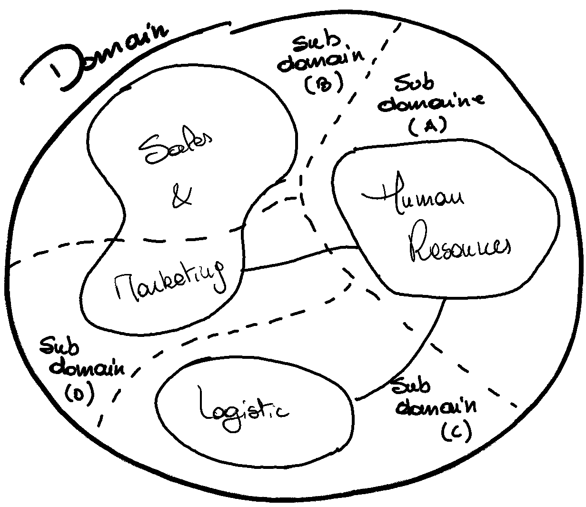

Avant d'entamer le processus de mise en place d'une architecture orientée événement, il est important de définir les concepts de base qui seront utilisés. La définition des concepts permet de comprendre ce que l'on fait et pourquoi on le fait. Autrement dit, à quoi répondent les concepts liés à l'architecture orientée événement et comment le font-ils.

## Domain Driven et Bounded Context

- **Domaine** : Le domaine défini l'ensemble des concepts, des règles métier et des entités qui sont liées entre elles et qui définissent un certain contexte métier. Vulgairement, le domaine est le métier de l'entreprise.
- **Sous-domaine** : Un sous-domaine est un sous-ensemble spécifique du domaine qui se concentre sur un aspect particulier du domaine global.
- **Modèle** : Le modèle est une représentation abstraite et simplifiée du domaine et des sous-domaines qui est utilisée pour répondre aux fonctionnalités de ce domaine.
- **Bounded context** : Le _bounded context_ est une frontière conceptuelle dans laquelle un modèle spécifique est défini et maintenu, de même que les processus, les événements, les règles métier et les entités qui sont liées à ce modèle et pertinentes pour un ou plusieurs sous-domaines.

Les notions de domaine et bounded context sont des concepts qui peuvent se confondre. La où le sous-domaine est lié à un métier, le bounded context est lié à la modélisation d'un processus métier. Par conséquent un bounded context peut être associé à un ou plusieurs sous-domaines. Les modèles seront alors adaptés pour répondre aux besoins du bounded context.

Le _bounded context_ est une notion fondamentale et importante dans le _Domain Driven Design_ (DDD). Il définit un périmètre qui trace les limites d'un context métier dans lequel une ou plusieurs fonctionnalités sont définies ainsi qu'un modèle qui est adapté à ce contexte. Généralement le modèle d'un _bounded context_ est limité a celui-ci et par conséquent invisible pour les autres _bounded context_ et domaines. Concrètement, ce _bounded context_ peut être une fonction, une application, un projet, un programme (ensemble d'application), etc.

## Message vs. Event

Un message est une unité de communication entre systèmes distribués. Il contient toutes les données utiles au traitement d'une tâche. Dans une représentation orientée objet, un message serait la classe abstraite qui contient les attributs de bases pour faire transiter des informations d'un système à un autre. Un des attributs définirait le type de message (ex: Command, Event, etc.).

Un événement est une spécification du message. Il est utilisé pour notifier les autres systèmes d'un changement d'état. Il est considéré comme suffisant, c'est-à-dire qu'il contient toutes les informations nécessaires pour être traitées par les systèmes qui le reçoivent.

Dans tous les cas, le message et plus spécifiquement l'event est le lien, le seul point de cohésion, entre les systèmes. Il est dès lors primordial de bien les définir, les documenter et les valider de manière à éviter les erreurs d'interprétation.

## Implémentation orientée communication vs. construction sur base des événements

Le _D_ de _Driven_, que ce soit pour le TDD (Test Driven Development), le DDD (Domain Driven Development), etc., défini qui est le moteur de la conception.

L'_Event Driven Architecture_ se construit autour des événements. Par conséquent, dans le processus de conception, l'identification des événements est la première étape (_Event Storming_).

Ces événements vont soit être utilisés pour faire communiquer les systèmes entre eux, soit vont être stockés comme une donnée à part entière et consommée par une application.

Cette différence est fondamentale pour la conception de l'architecture orientée événement, car la réponse technique est différente en termes de topologie, de stockage, de distribution, etc.

### Implémentation orientée communication

Dans le cas d'une implémentation orientée communication, les événements sont utiles pour **faire communiquer** deux applications entre-elles. Par exemple, le `System B` doit être notifié d'un message envoyé de manière asynchrone depuis le `System A`.

Par exemple, lorsque l'application de calcule des salaires termine le traitement de génération d'un lot de virement à effectuer, il envoie un événement pour notifier le système de paiement que le lot est prêt à être traité. Celui peut alors récupérer le lot et créer les paiements associés.

La réponse technique implique une distribution des événements aux systèmes qui en ont besoin, c'est-à-dire, une approche _publish-subscribe_. Ce paradigme ne nécessite pas de stockage centralisé des événements.

Chaque système est responsable de la gestion des événements qu'il reçoit et stocke les informations utiles pour son traitement. Les données sont gardées et le cas échéant dupliquées dans chaque système qui en a besoin.

Selon les cas, il peut être nécessaire de déterminer des systèmes maîtres de la donnée pour éviter les incohérences.

### Construction sur base des événements

La construction des systèmes s'articule autour des **données** et plus spécifiquement des événements. Sur base de ceux-ci, les microservices vont pouvoir exécuter des traitements et produire eux-mêmes des événements qui seront stockés et mis à disposition.

Dans ce contexte, les événements sont stockés dans des zones de stockage centralisées. Dès lors, la production des événements est dissociée de leur stockage et accès.

Pour reprendre l'exemple précédent, l'application de gestion des salaires va produire un événement qui sera stocké dans une zone de stockage centralisée. Le système de paiement va alors consommer cet événement pour traiter le lot de paiement.

Ce type d'architecture introduit également la notion de _single source of truth_ et _single version source of truth_ qui va définir la source de vérité pour les données. Cela permet de garantir que les données sont cohérentes et que les systèmes qui les consomment ont accès à la dernière version des données. Dans ce cas la _single source of truth_ est l'event stream.

Une différence fondamentale est que, par le biais de mécanismes natifs aux différents outils de stockage des événements, un nouveau système va pouvoir consommer les événements passés et ainsi se mettre à jour.

## Event Broker vs. Message Broker

L'architecture orienté évènement repose avant tout sur la distribution des événements. Pour répondre à ce besoin, il existe deux types de brokers : les _Event Broker_ et les _Message Broker_.

| Event Broker | Message Broker |
|--------------|----------------|
| Stocke les événements de manière durable | Stocke les messages de manière temporaire |
| Utilise des streams pour stocker les événements | Utilise des queues pour stocker les messages |
| N'utilise pas de _dead letter queue_ | Utilise une _dead letter queue_ pour les messages non distribués |
| N'utilise pas d'accusé de réception | Utilise des accusés de réception pour garantir la distribution des messages |
| Permet l'accès à l'ensemble des événements de tous les streams | Permet l'accès aux messages non-consommés |

### Event Broker

L'_event broker_ est composant logiciel qui permet de stocker et de distribuer les événements aux différents systèmes qui en ont besoin.

Lorsqu'un événement est émis, il est stocké **dans l'ordre de réception** dans un _event stream_. Cet _event_ peut être reparti dans plusieurs partitions pour garantir la scalabilité et la performance. Une partition est une division d'un _event stream_ en plusieurs sous-ensembles.

Chaque microservice qui a besoin de consommer les événements d'un _event stream_ va être associé à un _consumer group_ qui est responsable de la lecture des événements sur une ou plusieurs partitions.

Le microservice va alors lire les événements de manière séquentielle et stocker l'_offset_ de lecture pour reprendre la lecture là où il s'est arrêté. L'_offset_ est la position de lecture dans une partition d'un _event stream_.

L'attribution des partitions à une instance est gérée en coordination entre les instances du microservice et le broker. Ce mécanisme permet de garantir que chaque partition est lue par une seule instance pour chaque consumer group.

Dans le graphique ci-dessous, les _consumer group_ ont la responsabilité d'associer la lecture d'une partition à une instance de microservice et de gérer son _offset_ de lecture. Depuis un consumer group, il ne peut pas avoir plusieurs _offset_ sur la même partition. Par contre, plusieurs consumer group peuvent lire la même partition.

Il existe plusieurs types d'événements :

- **Unkeyed Events** : les événements sans clé sont utilisés pour les événements qui n'ont pas besoin d'être identifiés de manière unique et qui décrivent un changement global. Par exemple, un événement de _heartbeat_.

- **Entity Events** : les événements d'entité représentent une entité unique où la clé est l'identifiant de celle-ci. Généralement, ces événements sont utilisés pour conserver un historique des changements d'une entité où le dernier événement est la source de vérité.

- **Keyed Event** : les événements à clé ne représentent pas une entité unique, mais un événement identifiable. Généralement ceux-ci sont enregistrés dans des _event streams_ différents sur base de leurs types, assurant ainsi le partitionnement des événements permettant ensuite de retrouver les événements de manière efficace.

### Message Broker

Les messages brokers ne peuvent pas être utilisés pour stocker des événements de manière durable et ne sont donc pas adaptés pour une architecture _event driven_ avec _event stream_.

Ils sont essentiellement utilisés pour faire communiquer des systèmes de manière synchrone. Les messages sont stockés de manière temporaire dans des queues et sont distribués aux systèmes qui en ont besoin.

Lorsqu'un message n'est pas distribué, car le _message broker_ n'a pas reçu d'accusé de réception, il est stocké dans une _dead letter queue_ pour être traité ultérieurement.

Chaque consommateur a sa propre _subscription_ à la queue et peut donc consommer les messages de manière indépendante des autres consommateurs.
