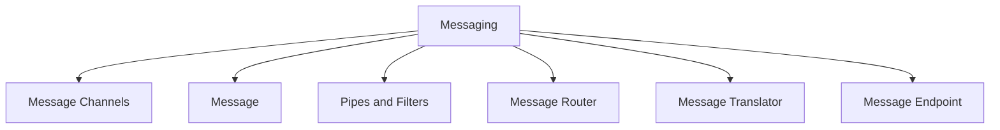

## Organisation de la documentation

Pour cette documentation, je me base principalement sur le livre *Enterprise Integration Patterns* de Gregor Hohpe et Bobby Woolf, qui est la référence en la matière. Ce livre a été publié en 2003, mais reste malgré tout d'actualité, car les concepts fondamentaux de l'intégration d'entreprise et du messaging asynchrone qu'il présente sont toujours valables, même dans le contexte des architectures cloud modernes.

Le livre est organisé en six grandes sections, chacune couvrant un aspect clé de l'intégration d'entreprise :

Ces sections sont reprises dans les chapitres du livre :

- **Messaging Channels** : Les canaux de communication entre les systèmes.
- **Message Construction** : La structure et le format des messages échangés.
- **Message Routing** : Le traitement des messages en transit.
- **Message Transformation** : La conversion des messages entre différents formats.
- **Messaging Endpoints** : Les points d'entrée et de sortie des messages dans les systèmes.
- **System Management** : La gestion et la surveillance des systèmes de messagerie.

Parce que l'organisation du livre est très claire et pragmatique, je reprendrai cette structure pour organiser la documentation des patterns de messaging asynchrone. Dans chacune des sections, je détaillerai les patterns spécifiques, leurs cas d'utilisation, et comment les implémenter.

:::tip
Pour ceux qui souhaitent aller plus loin, je recommande vivement la lecture du livre original *Enterprise Integration Patterns* qui offre une compréhension approfondie des concepts et des patterns d'intégration d'entreprise. En outre, l'article du blog de Paco de la Cruz, [Enterprise Integration Patterns on Azure - Introduction](https://pacodelacruz.io/enterprise-integration-patterns-on-azure-intro), propose une excellente introduction aux patterns d'intégration dans le contexte des services cloud Azure.
:::

Bonne lecture !

## Références

### Bibliographie

| Référence | Couverture |
|-----------|-----------|
| HOHPE, Gregor et WOOLF, Bobby. *Enterprise Integration Patterns: Designing, Building, and Deploying Messaging Solutions*. Boston: Addison-Wesley Professional, 2003. ISBN 0321200683. |  |

### Articles et ressources en ligne

| URL | |
|--|--|
| [Enterprise Integration Patterns on Azure - Introduction](https://pacodelacruz.io/enterprise-integration-patterns-on-azure-intro) | Blog de Paco de la Cruz |
