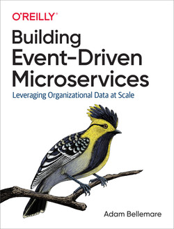

Cette documentation est un carnet de route dans lequel sont inscrites les étapes et les notions qui ont été nécessaires à la compréhension et la mise en place de microservices dans une architecture événementielle.

## Remerciements

Merci à [Mathieu Scolas](https://github.com/worming004) pour ses précieux conseils, son aide et sa relecture pour la rédaction de cette documentation.

## Sources

- [Learning Domain-Driven Design](https://www.oreilly.com/library/view/learning-domain-driven-design/9781098115501/) de Vlad Khononov.

## Table des matières

import DocCardList from '@theme/DocCardList';

<DocCardList />